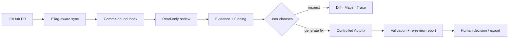
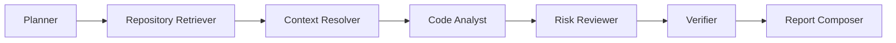
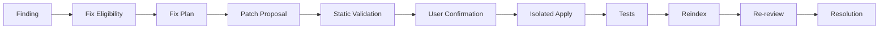
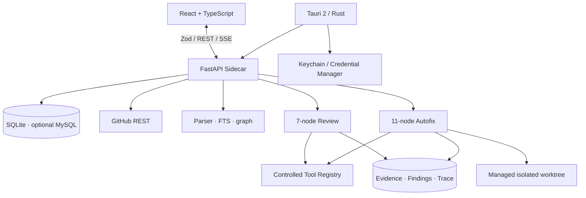

<div align="center">
  
  <h1>TraceGate Studio</h1>
  <p><strong>Evidence-grounded PR review and controlled coding-agent Autofix, on your machine.</strong></p>
  <p>
    <a href="README.md">English</a> ·
    <a href="docs/README_CN.md">简体中文</a>
  </p>
  <p>
    <a href="https://github.com/Chloiris/TraceGate-Eval/actions/workflows/ci-backend.yml"></a>
    <a href="https://github.com/Chloiris/TraceGate-Eval/actions/workflows/ci-frontend.yml"></a>
    <a href="https://github.com/Chloiris/TraceGate-Eval/actions/workflows/ci-security.yml"></a>
    <a href="LICENSE"></a>
  </p>
</div>


> The hero image comes from an isolated Playwright repository fixture. It
> verifies the running UI path, not a public-PR or live-model result. Evidence
> records below keep fixture, real-local, real-model, and public-PR scopes
> separate.

## 1. Product Overview

**TraceGate-Eval** is the repository. **TraceGate Studio** is its local-first
desktop and full-stack product. **TraceGate Eval** is the preserved research
and evaluation subsystem; **ClaimBench** is its controlled claim benchmark,
and **Semantic PR Advisor** is the PR semantic-review module.

Studio joins a React UI, authenticated FastAPI Sidecar, commit-bound code
intelligence, observable LangGraph workflows, controlled tools, and Tauri 2.
Version `0.4.0` adds a separate controlled Autofix path: it may propose and
validate a patch, but it cannot silently mutate the enrolled workspace or push
code. The feature branch has completed its full macOS matrix, native package,
scoped real-model run, and source-bound Windows CI/package gate. Public-PR Fix
evidence and Windows graphical acceptance remain explicitly blocked.

## 2. Why TraceGate

Passing tests do not prove that a change is safe. A patch may follow stale
incident text, delete compatibility behavior, cite the wrong commit, or pass a
narrow suite while leaving the original risk intact. TraceGate keeps the
questions inspectable:

- Which repository, Head SHA, path, line range, Evidence row, Agent step, and
  Tool Call support a Finding?
- Is contextual evidence `active`, `stale`, `unknown`, or `conflicting`?
- Is a relationship statically confirmed, merely inferred, or unknown?
- Did validation actually run, and did re-review still support the Finding?
- Did a provider, parser, or test fail instead of being replaced by a fixture
  or rule fallback?

## 3. Product Loop


```mermaid
flowchart LR
  PR["GitHub PR"] --> SYNC["ETag-aware sync"]
  SYNC --> INDEX["Commit-bound index"]
  INDEX --> REVIEW["Read-only review"]
  REVIEW --> FINDING["Evidence + Finding"]
  FINDING --> DECIDE{"User chooses"}
  DECIDE -->|"inspect"| MAPS["Diff · Maps · Trace"]
  DECIDE -->|"generate fix"| FIX["Controlled Autofix"]
  FIX --> REPORT["Validation + re-review report"]
  REPORT --> HUMAN["Human decision / export"]
```

The review graph remains read-only. A Fix Session is created only for an
existing persisted Finding and has its own state, audit trail, workspace, and
failure states.

## 4. Review Workflow

The production review workflow has seven persisted nodes:


```mermaid
flowchart LR
  A["Planner"] --> B["Repository Retriever"] --> C["Context Resolver"]
  C --> D["Code Analyst"] --> E["Risk Reviewer"] --> F["Verifier"]
  F --> G["Report Composer"]
```

The nodes use a 19-tool schema-validated Registry with permission, path,
timeout, output, and enablement controls. Findings must survive application-
side Head-SHA, file, range, and Evidence checks. The model cannot promote an
inferred parser relationship into a confirmed static edge.

## 5. Autofix Workflow

Autofix is a separate 11-node workflow rather than an extension of review:


```mermaid
flowchart LR
  A["Finding"] --> B["Fix Eligibility"] --> C["Fix Plan"]
  C --> D["Patch Proposal"] --> E["Static Validation"]
  E --> F["User Confirmation"] --> G["Isolated Apply"]
  G --> H["Tests"] --> I["Reindex"] --> J["Re-review"]
  J --> K["Resolution"]
```

Its observable node names are `LOAD_FINDING`, `CHECK_FIX_ELIGIBILITY`,
`PLAN_FIX`, `GENERATE_PATCH`, `VALIDATE_PATCH`,
`AWAIT_USER_CONFIRMATION`, `APPLY_PATCH`, `RUN_VALIDATION`,
`REINDEX_CHANGES`, `RE_REVIEW`, and `FINALIZE`.

The proposal is a real structured model output on the production path. It is
untrusted until unified-diff parsing, bounded safety checks, exact Head-SHA
checks, and `git apply --check` succeed. The five final resolutions are
`RESOLVED`, `PARTIALLY_RESOLVED`, `NOT_RESOLVED`, `VERIFICATION_FAILED`, and
`NEEDS_HUMAN_REVIEW`.

## 6. Patch Safety Model

Default behavior is **read-only** and `PROPOSE_ONLY` is available. Applying a
proposal requires an explicit user confirmation bound to Fix Session,
repository, PR, Finding, Head SHA, normalized patch SHA-256, nonce, and expiry.
Changing the patch or PR Head invalidates that confirmation; it is single-use.

Apply runs in a Fix-owned detached Git worktree at the exact Head SHA. The
original enrolled workspace is not reset, cleaned, or edited. Patch paths,
symlinks, binary targets, sensitive paths, file count, and changed-line count
are checked before apply. Validation commands are argument vectors derived
from repository manifests and controlled presets—not model-authored shell
text—and run with a filtered environment, timeout, cancellation, and output
cap.

TraceGate does **not** automatically commit, push, comment on a PR, or merge.
A passing test alone is insufficient for `RESOLVED`; required validation,
reindex, and verifier-backed re-review must agree. Missing tests or uncertainty
stays visible as `NEEDS_HUMAN_REVIEW` or another non-success state.

See [Autofix safety](docs/autofix-safety.md) and
[ADR-003](docs/architecture/ADR-003-autofix-workflow.md).

## 7. Repository Map

Repository Map starts with a commit-bound persisted index and exposes
repository, directory, file, test, and symbol nodes. It supports directory
aggregation, filters, one/two-hop exploration, saved layout, and JSON/SVG/PNG
export. The response is intentionally capped for large graphs; reaching the
cap is not evidence that every node is displayed.

Only parser-confirmed edges enter the static map. Inferred and unknown
relationships remain provenance and are never upgraded by an LLM explanation.

## 8. Review Map

Review Map combines the real Base-to-Head Git diff, confirmed static neighbors,
persisted Agent Evidence, and Findings. It can jump to the corresponding Monaco
Diff range. Absence of a static edge is presented as incomplete context, not as
proof that no runtime dependency exists.


> Playwright fixture scope. This image verifies rendering and navigation only.

## 9. Agent Trace

Review persists `AgentRun`, `AgentStep`, `ToolCallRecord`, Evidence, and
Findings. Fix persists its own session, step, Tool Call, event, proposal,
confirmation, validation, and result records. Authenticated SSE supports resume
with `Last-Event-ID`; final JSON/patch/report downloads are read from persisted
authoritative state rather than reconstructed in the browser.

Failures, cancellation, stale Head SHA, expired confirmation, command timeout,
and missing tests remain first-class states. Raw secrets and unbounded provider
or subprocess output are not trace fields.

## 10. Eval Center

Eval Center preserves TraceGate Eval rather than relabelling it as product
telemetry. It renders 19 scored public-PR cases (12 active, 2 stale, 3 unknown,
2 conflicting) and 160 controlled ClaimBench rows across five modules, four
evidence states, and eight context groups. The public-PR set is intentionally
small and not statistically significant.


> Checked-in benchmark artifacts, not live Autofix accuracy evidence.

## 11. Desktop Experience

Tauri owns the native window, single-instance behavior, Sidecar lifecycle,
random per-launch loopback token, platform credential store, tray commands,
deep links, notifications, autostart preference, and true quit. The UI is
shared with browser development, but browser mode does not gain native secret
storage.

The Settings screen accepts GitHub and model API credentials through the
native bridge. Values are written directly to macOS Keychain or Windows
Credential Manager, then cleared; the API and UI receive only
`configured`/`missing` state.

## 12. Verified Evidence

| Evidence | Status | Honest scope |
| --- | --- | --- |
| Pre-Autofix macOS review path | `VERIFIED_MACOS` | Browser/API/SQLite, packaged arm64 Sidecar, bounded desktop lifecycle, and one real DeepSeek review E2E. Historical source-bound records are linked below. |
| Pre-Autofix Windows delivery | `VERIFIED_WINDOWS_CI` | Automated tests, secure-store round trip, Sidecar health, and unsigned NSIS/MSI/portable packaging at the recorded baseline SHA. |
| Windows graphical acceptance | `BLOCKED` | No real Windows install, WebView2, tray, notification, autostart, single-instance, cleanup, or uninstall acceptance. |
| Autofix workflow/API/UI on macOS | `VERIFIED_MACOS` | 269 Python, 60 TypeScript/Vitest, 22 Rust tests (+1 ignored), five fixture-labelled Playwright flows, packaged Sidecar health, Tauri build, and native app launch passed. |
| Real-model Autofix E2E | `VERIFIED_MACOS` | One real DeepSeek run reached `RESOLVED` on an explicitly labelled synthetic temporary Git repository. |
| Autofix Windows build | `VERIFIED_WINDOWS_CI` | Source-bound run `29196292381` passed 269 Python, 60 TypeScript, 22 Rust (+1 ignored), PyInstaller Sidecar health, Tauri NSIS/MSI and portable packaging. This is not GUI acceptance. |
| Real public-PR Autofix E2E | `BLOCKED` | No small public PR with a defensible existing defect and stable local validation was selected; no random PR is presented as success evidence. |

Autofix fixture screenshots:

| Confirmation | Final report |
| --- | --- |
| [](docs/screenshots/autofix-playwright-fixture-confirmation-macos.png) | [](docs/screenshots/autofix-playwright-fixture-result-macos.png) |

> Both images are Playwright fixture evidence. They are not a real model run,
> real local repository result, or public-PR Autofix result.

## 13. Architecture


```mermaid
flowchart TB
  UI["React + TypeScript"] <-->|"Zod / REST / SSE"| API["FastAPI Sidecar"]
  HOST["Tauri 2 / Rust"] --> API
  HOST --> VAULT["Keychain / Credential Manager"]
  API --> DB[("SQLite · optional MySQL")]
  API --> GH["GitHub REST"]
  API --> IDX["Parser · FTS · graph"]
  API --> REVIEW["7-node Review"]
  API --> FIX["11-node Autofix"]
  REVIEW --> REG["Controlled Tool Registry"]
  FIX --> REG
  FIX --> WT["Managed isolated worktree"]
  REVIEW --> TRACE[("Evidence · Findings · Trace")]
  FIX --> TRACE
```

Review and Fix share typed persistence and controlled primitives but have
separate state machines. This preserves the default read-only contract and
makes confirmation, mutation, rollback, and cleanup explicit.

## 14. Technology Stack

| Layer | Technology |
| --- | --- |
| Desktop | Tauri 2, Rust, PyInstaller Sidecar |
| Frontend | React, strict TypeScript, React Query, Zod, Monaco, React Flow |
| API/runtime | FastAPI, Pydantic, SQLAlchemy 2, Alembic, LangGraph |
| Storage | SQLite by default; optional MySQL migration/profile path |
| Code intelligence | Python AST; bounded JS/TS/Java adapters; ripgrep; FTS5 |
| Integrations | GitHub REST/Device Flow/PAT, OpenAI-compatible model providers, optional HMAC relay |
| Verification | pytest, Vitest, Playwright, Rust tests/clippy, guardrails, GitHub Actions |

## 15. Quick Start

Requirements: Python 3.11+, `uv`, Node.js 22+, pnpm 11+, and Rust stable for
native builds.

```bash
git clone https://github.com/Chloiris/TraceGate-Eval.git
cd TraceGate-Eval
./scripts/bootstrap.sh
./scripts/dev.sh
```

Open `http://127.0.0.1:5173`. Development mode starts the real authenticated
FastAPI service and Vite UI. It does not silently switch to mock analysis.

The research CLI remains available:

```bash
uv run python -m tracegate --help
uv run python -m tracegate data validate \
  --dataset datasets/real_min/cases.jsonl --strict --min-cases 8
```

## 16. Model Configuration

In the native app, use **Settings → Model** for provider metadata and
**Settings → Connections** for the API key. DeepSeek and OpenAI-compatible
endpoints use the production `OpenAICompatibleProvider`. Browser development
reads an explicitly provided backend variable such as `DEEPSEEK_API_KEY` or
`TRACEGATE_LLM_API_KEY`.

Only configuration presence may be displayed. Never paste a key into source,
README, `.env` committed to Git, screenshots, tests, database rows, or issue
logs. A missing or rejected provider is a visible failure; fixtures, cached
responses, and rule fallback cannot satisfy a real-model verification gate.

## 17. GitHub Configuration

Studio supports a fine-grained PAT and an implemented OAuth Device Flow. The
PAT onboarding field is a **GitHub access token**, not a repository URL. Use
minimum read permissions for selected repositories (`Pull requests: Read`,
`Checks: Read`, with GitHub-provided metadata access). Live Device Flow
authorization remains unverified in the current evidence set.

Repository enrollment is a separate step. Public unauthenticated reads are
explicit; private repository access requires a valid stored credential.

## 18. Autofix Usage

1. Synchronize and index the exact PR Head.
2. Run read-only review and open a persisted Finding.
3. Choose **Generate Fix** and inspect eligibility and the structured plan.
4. Generate the proposal; inspect changed files, warnings, full diff, and
   SHA-256 Patch Hash.
5. Confirm that exact hash before expiry.
6. Apply only to the managed isolated worktree.
7. Run the server-selected validation commands and watch persisted SSE events.
8. Reindex and re-review; inspect the deterministic resolution and residual
   risks/Findings.
9. Export the patch/report, roll back, or clean the Fix worktree.

See the complete [Autofix guide](docs/autofix-guide.md). API clients must send
the current `expected_lock_version`; stale retries receive an explicit
conflict instead of skipping a state.

## 19. Security

- Loopback-only bearer-authenticated Sidecar with exact CORS and bounded
  request/response surfaces.
- OS secure storage for credentials; secrets excluded from database, API,
  normal logs, screenshots, and Git.
- Canonical path and symlink containment, sensitive-file denial, patch limits,
  and binary rejection.
- Repository/PR/model text treated as untrusted data and unable to alter system
  policy or Tool permission.
- Argument-vector validation commands, filtered environment, timeout,
  cancellation, and bounded output.
- Patch Hash + Head SHA confirmation binding, isolated application, visible
  failure, bounded rollback, and managed cleanup.

Read [Security model](docs/security-model.md),
[Autofix safety](docs/autofix-safety.md), [Privacy](docs/privacy.md), and
[Security policy](SECURITY.md).

## 20. Testing

```bash
./scripts/test.sh
pnpm test:e2e
uv run python scripts/check_docs_consistency.py
uv run python -m tracegate guardrails scan --strict
```

The immutable pre-Autofix baseline is 212 Python, 30 TypeScript/Vitest, 22
passing Rust tests with one explicit native mutation test ignored, and four
Playwright flows. Current macOS verification records 269 Python, 60
TypeScript/Vitest, 22 Rust passing plus one ignored, and five Playwright flows.
The Autofix Playwright flow is a labelled UI fixture; the separate real-model
record uses a synthetic temporary Git repository.

## 21. Build and Packaging

```bash
./scripts/build-macos.sh
```

On Windows x86-64:

```powershell
.\scripts\bootstrap.ps1
.\scripts\build-windows.ps1
```

The source-bound Autofix Windows workflow produced an unsigned Setup.exe, MSI,
portable ZIP, `SHA256SUMS.txt`, and `build-info.json`; PyInstaller Sidecar
health and both Tauri bundles passed. See the
[Windows Autofix CI record](docs/verification/windows-autofix-ci.md). Windows
artifacts are unsigned, and `VERIFIED_WINDOWS_CI` does not imply
`VERIFIED_WINDOWS_MANUAL`.

## 22. Parser Boundaries

| Language | Current bounded capability |
| --- | --- |
| Python | AST-backed definitions/ranges and partial same-file direct calls, inheritance, imports, tests, and changed-symbol mapping. |
| JavaScript | Declaration-level ESM adapter; no semantic references or function-level call graph. JSX extraction is withheld. |
| TypeScript | Declaration-level ESM/export adapter; no type-system/reference/call resolution. TSX extraction is withheld. |
| Java | Declaration/import adapter; package targets, file/test edges, and call resolution are not confirmed. |

The detailed [parser capability matrix](docs/parser-capability-matrix.md)
contains all 12 audited rows and their `SUPPORTED`, `PARTIAL`, or
`UNSUPPORTED` limits. TraceGate uses bounded JS/TS/Java adapters; it does not
claim whole-program Java call resolution.

## 23. Current Limitations

- Real public-PR Autofix E2E is `BLOCKED`; the scoped real-model synthetic-repo
  run does not establish a success rate or automatic-fix accuracy.
- Validation command selection, cwd, and environment are controlled, but
  repository tests are not OS/container sandboxed and run with the local
  user's authority. Use a disposable environment for untrusted PRs.
- Windows artifacts are unsigned; Windows install, WebView2, tray,
  notifications, autostart, single-instance, process cleanup, and uninstall
  await manual target-platform tests.
- macOS status-item and notification-click interaction lack direct manual
  acceptance evidence.
- Live GitHub OAuth Device Flow authorization has not been completed.
- Vector embeddings are disabled; labelled text, symbol, FTS5, and ripgrep
  retrieval remain available.
- Large graphs are capped and aggregated; backend-local graph paging is not
  implemented.
- The parser uses bounded JS/TS/Java adapters, not full semantic call graphs.
- The 19-case real-PR set is intentionally small and not statistically
  significant.
- The historical real DeepSeek review used JSON compatibility tool selection;
  native OpenAI function calling is not claimed.
- Autofix does not auto-commit, auto-push, comment, open a PR, or merge.

## 24. Roadmap

Near-term gates are evidence work, not feature inflation: identify a defensible
public-PR Fix case without lowering safety gates and complete real Windows GUI
acceptance when a target machine is available. Signed distribution, live OAuth
evidence, and larger statistically designed evaluation sets remain future work.

P4/Perforce, UE/Maya host adapters, team service, cloud synchronization, and
automatic external mutations are not current product capabilities.

## 25. Documentation

| Document | Purpose |
| --- | --- |
| [Implementation status](docs/implementation-status.md) | Evidence-backed current state and pending gates |
| [Autofix guide](docs/autofix-guide.md) | User/API lifecycle and recovery |
| [Autofix safety](docs/autofix-safety.md) | Patch, confirmation, command, and workspace boundaries |
| [ADR-003](docs/architecture/ADR-003-autofix-workflow.md) | Why Review and Fix are separate |
| [API reference](docs/api.md) | Authenticated Studio and Fix endpoints |
| [Product tour](docs/product-tour.md) | UI walkthrough and data provenance |
| [Parser matrix](docs/parser-capability-matrix.md) | Per-language static-analysis limits |
| [Real Autofix E2E record](docs/verification/real-autofix-e2e-macos.md) | `VERIFIED_MACOS` synthetic temporary-repository run; public-PR scope `BLOCKED` |
| [Windows Autofix CI record](docs/verification/windows-autofix-ci.md) | `VERIFIED_WINDOWS_CI` tests, Sidecar health, installers and hashes |
| [Windows manual checklist](docs/windows-manual-acceptance.md) | Graphical target-platform acceptance |
| [Documentation audit](docs/doc-consistency-audit.md) | Canonical names, facts, links, and remaining drift |

## 26. License

Contributions should preserve provenance, explicit failure behavior, migration
compatibility, and secret hygiene. Start with [CONTRIBUTING.md](CONTRIBUTING.md).

TraceGate is available under the [MIT License](LICENSE). Packaged third-party
components retain their own licenses.
