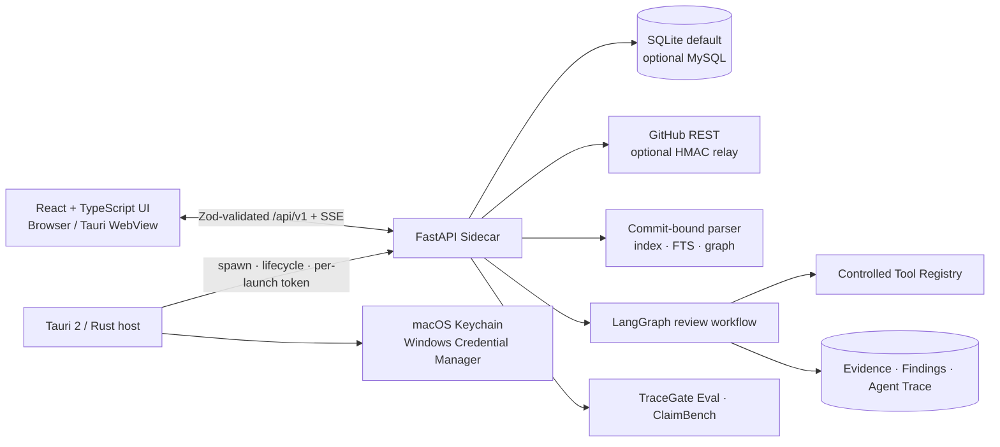
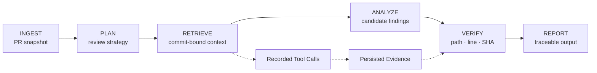
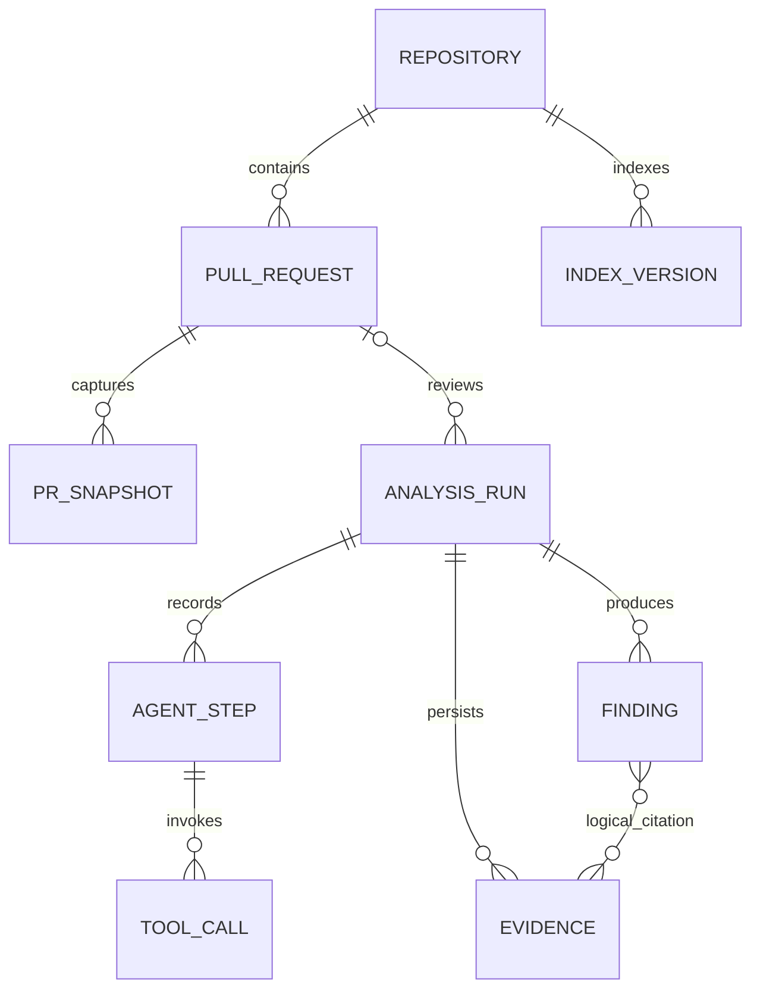

<div align="center">
  
  <h1>TraceGate Studio</h1>
  <p><strong>Evidence-grounded AI coding agent and Pull Request review workspace</strong></p>
  <p>
    TraceGate connects GitHub changes, commit-bound code intelligence, controlled
    agent tools, verifiable findings, and reproducible evaluation in one local-first desktop product.
  </p>
  <p>
    <a href="README.md">English</a> ·
    <a href="docs/README_CN.md">简体中文</a>
  </p>
  <p>
    <a href="https://github.com/Chloiris/TraceGate-Eval/actions/workflows/ci-backend.yml"></a>
    <a href="https://github.com/Chloiris/TraceGate-Eval/actions/workflows/ci-frontend.yml"></a>
    <a href="https://github.com/Chloiris/TraceGate-Eval/actions/workflows/ci-rust.yml"></a>
    <a href="https://github.com/Chloiris/TraceGate-Eval/actions/workflows/ci-security.yml"></a>
    <a href="https://github.com/Chloiris/TraceGate-Eval/actions/workflows/build-windows.yml"></a>
    <a href="LICENSE"></a>
  </p>
</div>


> Running browser product flow over an isolated E2E repository fixture. The
> screenshot proves the UI path, not a public-repository or live-model result.
> A separately audited real DeepSeek run is documented below.

## Why TraceGate

A patch can compile and pass tests while still being unsafe: it may delete an
active compatibility path, follow a stale incident note, trust conflicting
history, or cite code that is no longer present at the reviewed commit.

TraceGate therefore asks more than _“did the patch pass?”_:

- Is every conclusion bound to the current repository, path, line range, and
  Head SHA?
- Is the supporting context `active`, `stale`, `unknown`, or `conflicting`?
- Which Agent step and Tool Call produced each Evidence row and Finding?
- Which graph edges are statically confirmed, and which are only inferred?
- Does a provider failure remain visible instead of becoming a synthetic
  success report?

The result is an inspectable coding-agent workflow rather than a black-box
review summary.

## Product loop


```mermaid
flowchart LR
  PR["GitHub Pull Request"] --> SYNC["ETag-aware sync<br/>metadata · commits · files · checks"]
  SYNC --> INDEX["Commit-bound index<br/>parser · symbols · FTS · graph"]
  INDEX --> AGENT["LangGraph review<br/>plan · retrieve · analyze · verify"]
  AGENT --> TOOLS["Controlled Tool Registry<br/>read · search · diff · tests"]
  TOOLS --> EVIDENCE["Evidence + Finding<br/>path · line · SHA · confidence"]
  EVIDENCE --> UX["Diff · Review Map · Change Tour<br/>Agent Trace · report"]
  UX --> HUMAN["Human review"]
```

### What is implemented

| Area | Production path |
| --- | --- |
| GitHub ingestion | PR metadata, files, commits, comments, Checks, rate limits, ETag polling, Head-SHA deduplication, fine-grained PAT, and an implemented OAuth Device Flow whose live authorization still requires user configuration. |
| Code intelligence | Incremental commit-bound index, Python AST, bounded JS/TS/Java adapters, ripgrep, symbols, SQLite FTS5, Repository Map, Review Map, and Change Tour. |
| Agent runtime | Seven persisted LangGraph nodes, structured state, cancellation, bounded retry, SSE, 19 schema-validated tools, and provider/tool-mode provenance. |
| Review experience | PR Inbox, nine-tab PR details, Monaco Diff, Findings, Evidence, Agent Trace, Agent Evidence Graph, graph-to-diff jumps, JSON/SVG/PNG exports. |
| Evaluation | Existing TraceGate Eval, 19-case real-PR hard set, 160-run controlled ClaimBench, confusion matrix, case drill-down, model/context comparisons, and report export. |
| Desktop | Tauri 2 shell, bundled Python Sidecar, per-launch loopback token, Keychain/Credential Manager, close-to-hide, single-instance foundation, tray commands, deep links, notifications, and autostart controls. |
| Delivery | macOS arm64 package plus Windows x86-64 NSIS, MSI, portable ZIP, checksums, build metadata, and Sidecar health checks in GitHub Actions. |

## Verified evidence

TraceGate uses explicit verification states. `VERIFIED_WINDOWS_CI` never means
`VERIFIED_WINDOWS_MANUAL`.

| Evidence | Status | Result |
| --- | --- | --- |
| macOS product runtime | `VERIFIED_MACOS` | React/FastAPI/SQLite/Tauri paths, packaged arm64 Sidecar health, close-to-hide, true quit, single instance, browser flows, and secure-store round-trip were exercised. |
| Real model E2E | `VERIFIED_MACOS` | `deepseek-chat` on public [`psf/requests#7565`](https://github.com/psf/requests/pull/7565): 4 real requests, 3 completed `search_code` Tool Calls, 7 Agent Trace rows, 1 Evidence, 1 Finding, and 3,826 tokens. |
| Automated test matrix | `VERIFIED_MACOS` / `VERIFIED_WINDOWS_CI` | Current local macOS and source-bound Windows runs each passed 212 Python, 30 TypeScript/Vitest, and 22 Rust tests; the native Windows Credential Manager mutation test passed separately 1/1. |
| Windows x86-64 delivery | `VERIFIED_WINDOWS_CI` | The source-bound [push run](https://github.com/Chloiris/TraceGate-Eval/actions/runs/29176975492) and its companion [PR run](https://github.com/Chloiris/TraceGate-Eval/actions/runs/29176976588) built and uploaded an unsigned Setup.exe, MSI, portable ZIP, hashes, and metadata after an authenticated Sidecar health check. |
| Controlled benchmark | `VERIFIED_MACOS` | 160 checked-in ClaimBench runs across five modules, four evidence states, and eight context groups. |
| Real-data hard set | `VERIFIED_MACOS` | 19 scored public-PR cases: 12 active, 2 stale, 3 unknown, and 2 conflicting. The set is intentionally small and not statistically significant. |
| Windows desktop interaction | `BLOCKED` | Installation, WebView2, tray, notifications, autostart, single-instance behavior, uninstall, and process cleanup still require a real Windows graphical desktop. |

Detailed records:

- [Implementation status](docs/implementation-status.md)
- [Real-model macOS E2E](docs/verification/real-model-e2e-macos.md)
- [Windows x86-64 CI verification](docs/verification/windows-ci.md)
- [macOS P1 verification](docs/verification/p1-macos.md)
- [Performance measurements](docs/performance.md)

The real-model run used a fresh checkout, migrated SQLite database, production
`OpenAICompatibleProvider`, production LangGraph workflow, and the real
read-only Tool Registry. It used no fixture, mock, cached result, or rule
fallback. JSON compatibility tool selection was recorded explicitly; native
OpenAI function calling is not claimed for that run.

## Architecture


```mermaid
flowchart LR
  UI["React + TypeScript UI<br/>Browser / Tauri WebView"] <-->|"Zod-validated /api/v1 + SSE"| API["FastAPI Sidecar"]
  HOST["Tauri 2 / Rust host"] -->|"spawn · lifecycle · per-launch token"| API
  HOST --> VAULT["macOS Keychain<br/>Windows Credential Manager"]
  API --> DB[("SQLite default<br/>optional MySQL")]
  API --> GH["GitHub REST<br/>optional HMAC relay"]
  API --> IDX["Commit-bound parser<br/>index · FTS · graph"]
  API --> WF["LangGraph review workflow"]
  WF --> TOOLS["Controlled Tool Registry"]
  WF --> TRACE[("Evidence · Findings · Agent Trace")]
  API --> EVAL["TraceGate Eval · ClaimBench"]
```

### Agent and evidence pipeline


```mermaid
flowchart LR
  I["INGEST<br/>PR snapshot"] --> P["PLAN<br/>review strategy"]
  P --> R["RETRIEVE<br/>commit-bound context"]
  R --> A["ANALYZE<br/>candidate findings"]
  A --> V["VERIFY<br/>path · line · SHA"]
  V --> O["REPORT<br/>traceable output"]

  R -.-> T["Recorded Tool Calls"]
  T -.-> E["Persisted Evidence"]
  E -.-> V
```

### Traceability model


```mermaid
erDiagram
  REPOSITORY ||--o{ PULL_REQUEST : contains
  PULL_REQUEST ||--o{ PR_SNAPSHOT : captures
  PULL_REQUEST o|--o{ ANALYSIS_RUN : reviews
  REPOSITORY ||--o{ INDEX_VERSION : indexes
  ANALYSIS_RUN ||--o{ AGENT_STEP : records
  AGENT_STEP ||--o{ TOOL_CALL : invokes
  ANALYSIS_RUN ||--o{ EVIDENCE : persists
  ANALYSIS_RUN ||--o{ FINDING : produces
  FINDING }o--o{ EVIDENCE : logical_citation
```

This is a logical traceability model, not a physical foreign-key diagram.
Finding-to-Evidence citations and run/index identity are also checked at the
application layer using repository and Head-SHA provenance.

## Product gallery

The product screenshots in this gallery are runtime captures, not static
design mockups. Each capture is labelled with its data boundary.

### PR Diff and evidence markers

[](docs/screenshots/p1-pr-diff-macos.png)

Running browser flow over the test-only E2E repository fixture. It verifies
navigation, Monaco Diff, and Finding/Evidence jumps; it is not presented as a
real public-PR analysis.

<details>
<summary><strong>Eval Center — checked-in real/controlled artifacts</strong></summary>

[](docs/screenshots/p1-eval-center-macos.png)

Running UI over the checked-in 19-case real-PR set and 160-run controlled
ClaimBench artifacts. It is not a live-model accuracy claim.
</details>

<details>
<summary><strong>Agent and Tool Registry</strong></summary>

[](docs/screenshots/p1-registry-macos.png)

The registry renders the seven workflow roles and 19 actual schema-validated
tools, including their permissions, limits, call counts, and execution policy.
</details>

## Code intelligence without overclaiming

Repository Map and Review Map only consume confirmed static edges. Inferred or
unknown observations remain provenance, and LLM explanations cannot upgrade
them into parser facts.

| Language | Implemented boundary |
| --- | --- |
| Python | AST-backed classes/functions/methods and ranges; partial same-file, lexically visible direct calls and inheritance. |
| JavaScript | Bounded top-level ESM/declaration adapter; no semantic references or function call graph. JSX is recognized but extraction is withheld. |
| TypeScript | Bounded ESM/exported declaration adapter; no type-system or function-call resolution. TSX extraction is withheld. |
| Java | Bounded imports/types/method declarations; package/type targets, file dependencies, test edges, and calls are not confirmed. Unicode-escape files withhold extraction. |

See the audited [parser capability matrix](docs/parser-capability-matrix.md) for
all 12 capabilities, `SUPPORTED`/`PARTIAL`/`UNSUPPORTED` states, and exact
limitations.

## Evaluation insight

TraceGate Eval separates test execution from evidence-aware safety. The
checked-in Stage3 result is one controlled `deepseek-v4-pro` run, not a general
model leaderboard or a production-quality estimate.

| Stage3 metric | Checked-in result |
| --- | ---: |
| Runs | 160 |
| Test success | 152/160 |
| Evidence-aware decision | 73/160 |
| Safe success | 68/160 |
| Destructive change | 2/160 |
| Context pollution | 15/160 |


The key observation is deliberate: high test success did not guarantee a
decision that respected current evidence. See [metrics](docs/metrics.md),
[result summary](results/summary.md), and the
[real-data card](docs/DATA_CARD_REAL_MIN.md).

## Quick start

### Requirements

- macOS or Linux for browser development; macOS arm64 for the native macOS package
- Python 3.11+ and [`uv`](https://docs.astral.sh/uv/)
- Node.js 22+ and pnpm 11+
- Rust stable for Tauri
- Java and Maven only for the controlled Java ClaimBench repositories

### Browser development

```bash
git clone https://github.com/Chloiris/TraceGate-Eval.git
cd TraceGate-Eval
./scripts/bootstrap.sh
./scripts/dev.sh
```

Open `http://127.0.0.1:5173`. The development script creates an ephemeral
loopback API token and starts the real FastAPI service plus Vite UI.

### Native macOS arm64 package

```bash
./scripts/build-macos.sh
```

### Windows x86-64 package

Build on a real Windows x86-64 host:

```powershell
.\scripts\bootstrap.ps1
.\scripts\build-windows.ps1
```

The GitHub Actions workflow additionally runs the complete checks, exercises
the packaged Sidecar health endpoint, creates unsigned NSIS/MSI/portable
artifacts, generates SHA-256 metadata, and uploads the result.

### Verification

```bash
./scripts/test.sh
pnpm test:e2e
uv run python -m tracegate guardrails scan --strict
```

### Credentials and model configuration

In the Tauri application, open **Settings → Connections** to
enter a GitHub token, model API key, or Relay token manually. Secrets are
written directly to Keychain/Credential Manager, the input is cleared after
save, and only `configured`/`missing` status returns to the UI. The running
Sidecar reloads the credential without an application restart.

Model Provider, Base URL, model name, temperature, output limit, timeout, and
context scope are configured under **Settings → Model**. DeepSeek and
OpenAI-compatible endpoints are supported. Browser development mode does not
write secrets and instead requires explicit environment variables such as
`DEEPSEEK_API_KEY` or `TRACEGATE_LLM_API_KEY`.

### Research CLI

The original evaluation and advisory commands remain available:

```bash
uv run python -m tracegate --help
uv run python -m tracegate data validate \
  --dataset datasets/real_min/cases.jsonl \
  --strict \
  --min-cases 8
uv run python -m tracegate guardrails scan --strict
```

See [TraceGate Eval overview](docs/PROJECT_MAP.md) and
[Semantic PR Advisor](docs/SEMANTIC_PR_ADVISOR_v0.3.md) for the full CLI paths.

## Security model

- Loopback-only FastAPI with a random per-launch bearer token and exact CORS.
- Desktop-stored credentials remain in Keychain/Credential Manager and are
  excluded from API schemas, SQLite, browser storage, screenshots, normal logs,
  and Git.
- Repository access rejects traversal, out-of-root symlinks, `.env`, SSH keys,
  and common cloud credential paths.
- Commands use an allowlist, repository-scoped working directory, filtered
  environment, timeout, and bounded output.
- GitHub responses, model responses, Tool outputs, and SSE payloads are bounded.
- HMAC verification and replay protection guard the optional webhook relay.
- Repository text is untrusted input and cannot change system rules or expand
  tool permissions.
- Telemetry is off by default; source, prompts, PR content, and credentials are
  not uploaded as telemetry.

Read [Security model](docs/security-model.md), [Privacy](docs/privacy.md), and
[`SECURITY.md`](SECURITY.md) before extending network or write capabilities.

## Repository map

```text
apps/web/                     React + TypeScript product UI
apps/desktop/src-tauri/       Tauri 2 host and platform capabilities
packages/shared-types/        Zod contracts shared across boundaries
packages/api-client/          Authenticated typed client and SSE parser
tracegate/studio/             FastAPI, SQLAlchemy, migrations, sync and runtime
tracegate/agent/              LangGraph workflow and structured state
tracegate/tools/              Controlled Tool Registry
tracegate/indexing/           Parser and commit-bound index
tracegate/graph/              Repository/Review Map construction
tracegate/metrics/            Preserved evaluation metric definitions
tracegate/reports/            Benchmark and advisory report generation
e2e/                          Playwright product flows
datasets/real_min/            Small public-PR evidence dataset
docs/                         Architecture, evidence, runbooks and status
```

## Current boundaries

- Windows artifacts are unsigned; SmartScreen and code signing are not verified.
- Windows GUI installation, tray, notification, autostart, single-instance,
  background-process, and uninstall behavior await manual target-platform tests.
- macOS tray construction is implemented, but direct status-item click and
  notification-click acceptance still need manual evidence.
- Live GitHub OAuth Device Flow authorization has not been exercised; the PAT
  path and Device Flow implementation are tested separately.
- Vector embeddings are disabled; labelled text/symbol/FTS/ripgrep retrieval
  remains available.
- Large graphs are capped and aggregated; backend-local graph paging remains
  future work.
- P4, UE/Maya host adapters, team service, and cloud synchronization are not
  implemented product capabilities.
- The 19-case real-data set is intentionally small and not statistically significant.

## Documentation

| Document | Purpose |
| --- | --- |
| [Architecture decision](docs/architecture/ADR-001-tracegate-studio.md) | Product boundaries and process model |
| [Implementation status](docs/implementation-status.md) | Evidence-backed platform status |
| [Product tour](docs/product-tour.md) | End-to-end feature walkthrough |
| [API reference](docs/api.md) | Authenticated `/api/v1` surface |
| [Parser matrix](docs/parser-capability-matrix.md) | Per-language static-analysis boundary |
| [Security model](docs/security-model.md) | Threats, controls, and trust boundaries |
| [Windows manual checklist](docs/windows-manual-acceptance.md) | Required graphical acceptance |
| [Troubleshooting](docs/troubleshooting.md) | Development and packaging recovery |

## Contributing and license

Contributions should preserve provenance and explicit failure behavior, include
tests and migrations for schema changes, and keep secrets/run artifacts out of
Git. Start with [`CONTRIBUTING.md`](CONTRIBUTING.md); discuss metric-definition
changes before implementation.

TraceGate is available under the [MIT License](LICENSE). Packaged third-party
components retain their own licenses.
