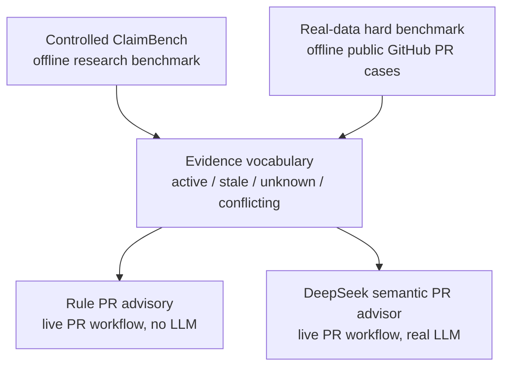

# TraceGate Project Map

TraceGate is a v0.3-alpha prototype for evaluating and applying historical
engineering evidence in AI coding workflows.

It is not an enterprise governance platform, not a general code review bot, and
not a model leaderboard. The repository contains two evaluation tracks and two
advisory modes that share the same evidence vocabulary.

## Four-Layer Architecture



## Layer 1: Controlled ClaimBench

Controlled ClaimBench is the original research experiment in this repository.
It asks whether historical engineering context helps an AI coding agent, and
whether misleading or stale context can pollute the generated patch.

It uses controlled local tasks across:

- 5 modules
- 4 evidence statuses
- 8 context groups
- 160 Stage3 runs

The context groups include no context, plain claims, claims with evidence,
TraceGate-routed evidence, verification-first guidance, misleading same-scope
context, and full unfiltered claim archives.

This track is an offline benchmark. The checked-in report summarizes a
`deepseek-v4-pro` Stage3 run, but reading or validating the report does not call
an LLM API. Re-running a model experiment may call a configured model provider.

## Layer 2: Real-Data Hard Benchmark

The real-data hard benchmark moves the same evidence vocabulary onto public
GitHub Pull Request records.

It is a small offline benchmark, not a statistically significant model
leaderboard. It validates provenance, label promotion, and guardrails around
real public PR evidence.

Current v0.2-alpha status:

```text
active=12
stale=2
unknown=3
conflicting=2
scored_cases=19
hard_benchmark_ready=true
```

Normal validation and rule runs for this track do not call an LLM:

```bash
python -m tracegate data validate --dataset datasets/real_min/cases.jsonl --strict --min-cases 12
python -m tracegate run --dataset datasets/real_min/cases.jsonl --advisor rule --real-only --no-mock --no-fallback
```

The accepted hard labels are human-accepted audit records. Labels that were
rejected or marked `needs_more_evidence` remain excluded from scored metrics.

## Layer 3: Rule PR Advisory

Rule PR advisory is the lightweight live Pull Request workflow. It reads PR
changed files and repository-local TraceGate configuration, then writes a
warning-only advisory summary.

It does not call an LLM. It remains useful because it is:

- deterministic
- cheap to run on every PR
- safe for fork or low-trust PR contexts
- a baseline for comparing semantic mode
- a fallback-free guardrail for changed-file routing

Keeping rule mode also helps prove that semantic mode is adding value beyond
simple path matching.

## Layer 4: DeepSeek Semantic PR Advisor

The DeepSeek semantic advisor is the v0.3 live PR mode.

It collects public PR evidence, builds an `EvidencePacket`, calls the real
DeepSeek API, validates the JSON response, applies local verifier rules, and
writes Markdown/JSON advisory output.

Semantic mode is explicit:

```bash
python -m tracegate pr analyze \
  --repo owner/name \
  --pr-number 123 \
  --mode semantic \
  --provider deepseek \
  --real-only \
  --no-mock \
  --no-fallback
```

It requires `DEEPSEEK_API_KEY` or `TRACEGATE_LLM_API_KEY`. In GitHub Actions,
same-repository PRs can use the repository `DEEPSEEK_API_KEY` secret. Fork PRs
do not receive that secret and are skipped with an explicit warning-only
message.

Semantic mode is still advisory-only. It does not block merges by default and
does not replace human review.

## LLM Usage Matrix

| Component | Calls an LLM? | Offline benchmark? | Live PR workflow? |
| --- | --- | --- | --- |
| Controlled ClaimBench | Yes when re-running model experiments; checked-in reports do not call APIs | Yes | No |
| Real-data hard benchmark | No for normal validate/run/report commands | Yes | No |
| Rule PR advisory | No | No | Yes |
| DeepSeek semantic PR advisor | Yes, via DeepSeek API | No | Yes |

## v0.2 vs v0.3

v0.2-alpha focused on hard real-data benchmark readiness:

- public GitHub PR cases
- accepted hard labels
- `hard_benchmark_ready=true`
- strict real/mock/synthetic/fallback separation

v0.3-alpha adds live semantic PR advisory:

- same-repository GitHub Actions semantic check
- `EvidencePacket` retrieval for a live PR
- real DeepSeek API call
- local verifier guardrails
- warning-only Markdown/JSON advisory output

The two versions are connected by the same core question: whether historical
evidence should be preserved, rejected as stale, verified first, or treated as
conflicting.
