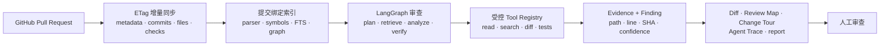
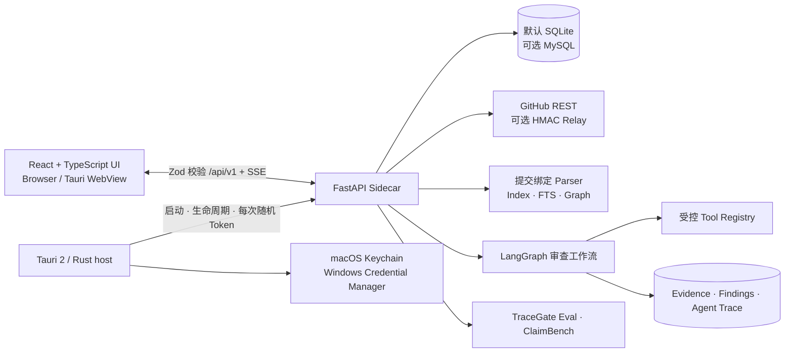
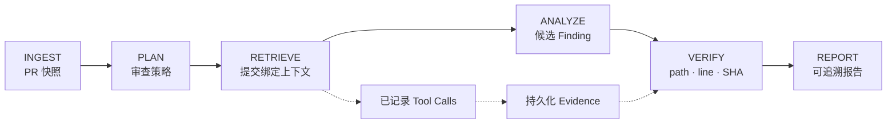
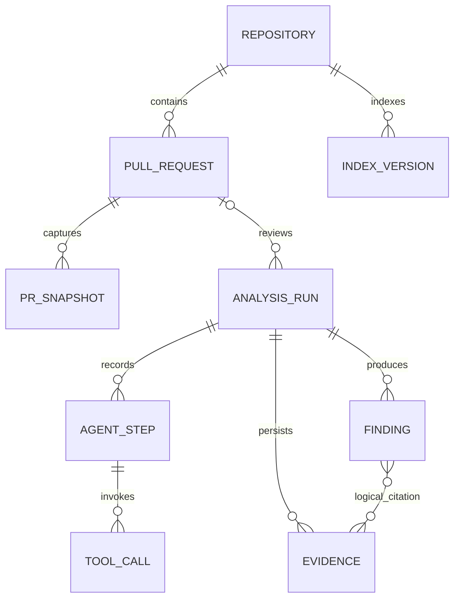
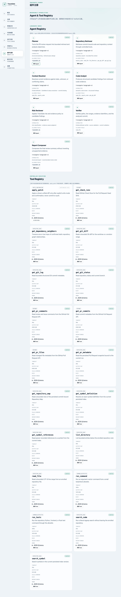
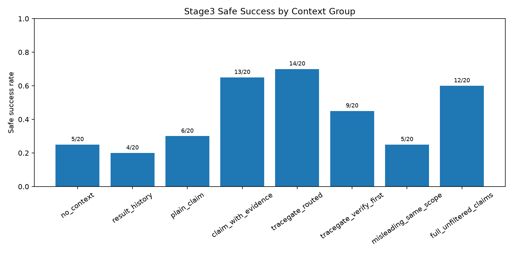

<div align="center">
  
  <h1>TraceGate Studio</h1>
  <p><strong>基于可追溯证据的 AI Coding Agent 与 Pull Request 审查工作台</strong></p>
  <p>
    TraceGate 将 GitHub 变更、提交绑定的代码理解、受控 Agent 工具、
    可验证 Finding 和可复现实验整合为一个本地优先的桌面产品。
  </p>
  <p>
    <a href="../README.md">English</a> ·
    <a href="README_CN.md">简体中文</a>
  </p>
  <p>
    <a href="https://github.com/Chloiris/TraceGate-Eval/actions/workflows/ci-backend.yml"></a>
    <a href="https://github.com/Chloiris/TraceGate-Eval/actions/workflows/ci-frontend.yml"></a>
    <a href="https://github.com/Chloiris/TraceGate-Eval/actions/workflows/ci-rust.yml"></a>
    <a href="https://github.com/Chloiris/TraceGate-Eval/actions/workflows/ci-security.yml"></a>
    <a href="https://github.com/Chloiris/TraceGate-Eval/actions/workflows/build-windows.yml"></a>
    <a href="../LICENSE"></a>
  </p>
</div>


> 这是隔离 E2E 测试仓库上的真实浏览器运行画面，用于证明 UI 路径，
> 不代表真实公开仓库或实时模型结果。独立审计的真实 DeepSeek E2E
> 证据在下文单独说明。

## 为什么需要 TraceGate

代码能够编译、测试能够通过，并不代表改动在工程语境中安全。Agent 仍可能删除
正在使用的兼容路径、采信已经过期的事故说明、误用互相冲突的历史信息，或引用
并不存在于当前提交中的代码。

因此 TraceGate 不只问“补丁是否通过测试”，还会追问：

- 每条结论是否绑定当前仓库、文件、行号和 Head SHA？
- 支撑结论的上下文是 `active`、`stale`、`unknown` 还是 `conflicting`？
- 哪个 Agent Step 和 Tool Call 产生了这条 Evidence 与 Finding？
- 哪些代码图关系由静态分析确认，哪些只是 inferred？
- 模型或网络失败时，系统是否真实暴露失败，而不是生成替代成功报告？

最终得到的是一个可以反查过程的 Coding Agent，而不是一个不可观察的审查摘要。

## 产品闭环



### 已实现的产品能力

| 模块 | 实际生产路径 |
| --- | --- |
| GitHub 数据接入 | PR metadata、文件、提交、评论、Checks、Rate Limit、ETag 轮询、Head-SHA 去重、Fine-grained PAT；OAuth Device Flow 已实现，但真实线上授权仍需用户配置。 |
| 代码理解 | 提交绑定增量索引、Python AST、受约束的 JS/TS/Java 适配器、ripgrep、符号检索、SQLite FTS5、Repository Map、Review Map 和 Change Tour。 |
| Agent 运行时 | 7 个真实持久化 LangGraph 节点、结构化状态、取消、有限重试、SSE、19 个 Schema 校验工具，以及 Provider/Tool 模式来源记录。 |
| 审查体验 | PR Inbox、九个 PR 详情页签、Monaco Diff、Finding、Evidence、Agent Trace、Agent Evidence Graph、图到 Diff 跳转和 JSON/SVG/PNG 导出。 |
| Eval | 保留 TraceGate Eval、19 条真实 PR hard cases、160-run ClaimBench、混淆矩阵、case drill-down、模型/上下文对比和报告导出。 |
| 桌面端 | Tauri 2、内置 Python Sidecar、每次启动随机本地 Token、Keychain/Credential Manager、关闭隐藏、单实例基础、托盘命令、Deep Link、通知和开机启动控制。 |
| 交付 | macOS arm64 包，以及由 GitHub Actions 生成的 Windows x86-64 NSIS、MSI、Portable ZIP、SHA256、构建信息与 Sidecar 健康检查。 |

## 已验证证据

TraceGate 使用明确的验收状态。`VERIFIED_WINDOWS_CI` 永远不等于
`VERIFIED_WINDOWS_MANUAL`。

| 证据 | 状态 | 结果 |
| --- | --- | --- |
| macOS 产品运行 | `VERIFIED_MACOS` | React/FastAPI/SQLite/Tauri、打包后的 arm64 Sidecar 健康检查、关闭隐藏、真正退出、单实例、浏览器流程和安全凭据回环均已执行。 |
| 真实模型 E2E | `VERIFIED_MACOS` | 在公开 [`psf/requests#7565`](https://github.com/psf/requests/pull/7565) 上调用 `deepseek-chat`：4 次真实请求、3 次完成的 `search_code` Tool Call、7 条 Agent Trace、1 Evidence、1 Finding、3826 Tokens。 |
| 自动测试矩阵 | `VERIFIED_MACOS` / `VERIFIED_WINDOWS_CI` | 当前本地 macOS 与源码绑定的 Windows 运行均通过 212 个 Python、30 个 TypeScript/Vitest、22 个 Rust 测试；Windows Credential Manager 原生变更测试另行执行并 1/1 通过。 |
| Windows x86-64 交付 | `VERIFIED_WINDOWS_CI` | 最近一次源码绑定的 [push run](https://github.com/Chloiris/TraceGate-Eval/actions/runs/29176975492) 及其对应 [PR run](https://github.com/Chloiris/TraceGate-Eval/actions/runs/29176976588) 在 Sidecar 鉴权健康检查后生成并上传未签名 Setup.exe、MSI、Portable ZIP、哈希和构建信息。 |
| Controlled Benchmark | `VERIFIED_MACOS` | 160 条已签入 ClaimBench 运行，覆盖 5 个模块、4 种 Evidence 状态和 8 个上下文组。 |
| Real-data hard set | `VERIFIED_MACOS` | 19 条已评分公开 PR：12 active、2 stale、3 unknown、2 conflicting。数据集刻意保持小规模，不具备统计显著性。 |
| Windows 图形界面操作 | `BLOCKED` | 安装、WebView2、托盘、通知、开机启动、单实例、卸载和进程清理仍需真实 Windows 图形桌面人工验收。 |

详细证据：

- [实现状态](implementation-status.md)
- [macOS 真实模型 E2E](verification/real-model-e2e-macos.md)
- [Windows x86-64 CI 验证](verification/windows-ci.md)
- [macOS P1 验证](verification/p1-macos.md)
- [性能实测](performance.md)

真实模型运行使用全新 Git checkout、迁移后的 SQLite、生产
`OpenAICompatibleProvider`、生产 LangGraph 和真实只读 Tool Registry，
没有使用 fixture、mock、缓存或规则 fallback。该次运行使用 JSON compatibility
工具选择，文档没有把它写成 OpenAI 原生 Function Calling。

## 系统架构



### Agent 与 Evidence 流程



### 可追溯数据关系



这是一张逻辑可追溯关系图，不是物理数据库外键图。Finding 对 Evidence 的引用，
以及 Run/Index 身份，还会在应用层通过 Repository 和 Head SHA 来源校验。

## 运行画面

本节产品截图均来自实际运行页面，不是静态设计稿；每张图都明确标注数据边界。

### PR Diff 与 Evidence 标记

[](screenshots/p1-pr-diff-macos.png)

这是测试专用 E2E 仓库上的真实浏览器流程，用于验证导航、Monaco Diff 和
Finding/Evidence 跳转，不会被包装成真实公开 PR 分析。

<details>
<summary><strong>Eval Center：已签入的真实/受控实验数据</strong></summary>

[](screenshots/p1-eval-center-macos.png)

页面读取已签入的 19 条真实 PR 和 160-run Controlled ClaimBench 数据，
不代表实时模型总体准确率。
</details>

<details>
<summary><strong>Agent 与 Tool Registry</strong></summary>

[](screenshots/p1-registry-macos.png)

Registry 展示 7 个真实工作流角色和 19 个 Schema 校验工具，包括权限、限制、
调用次数和执行策略。
</details>

## 不夸大的多语言代码理解

Repository Map 和 Review Map 只使用静态分析确认的边。inferred/unknown 关系
保留为来源信息，LLM 解释不能把它们升级为 Parser 事实。

| 语言 | 已实现边界 |
| --- | --- |
| Python | AST 类/函数/方法和范围；同文件、词法可见的直接调用和继承为 PARTIAL。 |
| JavaScript | 受约束的顶层 ESM/声明适配器；没有语义引用和函数调用图；识别 JSX，但停止提取。 |
| TypeScript | 受约束的 ESM/导出声明适配器；不解析完整类型系统或函数调用；TSX 停止提取。 |
| Java | 受约束的 import/type/method 声明；不确认 package/type 目标、文件依赖、测试边和调用；Unicode escape 文件停止提取。 |

完整 12 项能力、`SUPPORTED`/`PARTIAL`/`UNSUPPORTED` 状态与限制见
[Parser 能力矩阵](parser-capability-matrix.md)。

## Eval 实验结论

TraceGate Eval 将“测试是否执行成功”和“工程决策是否正确使用证据”分开评估。
下面的数据来自一次已签入的 `deepseek-v4-pro` Stage3 Controlled Run，
不是模型排行榜或生产质量估计。

| Stage3 指标 | 已签入结果 |
| --- | ---: |
| Runs | 160 |
| 测试成功 | 152/160 |
| Evidence-aware decision | 73/160 |
| Safe success | 68/160 |
| Destructive change | 2/160 |
| Context pollution | 15/160 |



核心观察是：测试成功率很高，并不能保证 Agent 的决策尊重当前工程证据。
更多内容见[指标定义](metrics.md)、[结果摘要](../results/summary.md)和
[Real-data Data Card](DATA_CARD_REAL_MIN.md)。

## 快速开始

### 环境要求

- macOS/Linux 用于浏览器开发；构建 macOS 原生包需要 Apple Silicon Mac
- Python 3.11+ 和 [`uv`](https://docs.astral.sh/uv/)
- Node.js 22+ 与 pnpm 11+
- Tauri 构建需要 Rust stable
- 只有运行 Controlled Java ClaimBench 仓库时才需要 Java 与 Maven

### 浏览器开发模式

```bash
git clone https://github.com/Chloiris/TraceGate-Eval.git
cd TraceGate-Eval
./scripts/bootstrap.sh
./scripts/dev.sh
```

打开 `http://127.0.0.1:5173`。开发脚本会创建临时 loopback API Token，
并启动真实 FastAPI 服务和 Vite UI。

### 构建 macOS arm64 原生包

```bash
./scripts/build-macos.sh
```

### 构建 Windows x86-64 包

必须在真实 Windows x86-64 主机运行：

```powershell
.\scripts\bootstrap.ps1
.\scripts\build-windows.ps1
```

GitHub Actions Workflow 还会执行完整测试、调用打包 Sidecar 的健康接口、
生成未签名 NSIS/MSI/Portable 产物、生成 SHA-256 并上传 Artifact。

### 验证命令

```bash
./scripts/test.sh
pnpm test:e2e
uv run python -m tracegate guardrails scan --strict
```

### 凭据与模型配置

在 Tauri 应用中打开 **设置 → 连接与凭据**，可以手动输入 GitHub Token、
模型 API Key 或 Relay Token。密钥直接写入 Keychain/Credential Manager；
保存后输入框会清空，WebView 只收到 `configured`/`missing` 状态；正在运行的
Sidecar 会立即重新加载，不需要重启应用。

Provider、Base URL、Model Name、Temperature、最大输出、Timeout 和代码上下文
范围在 **设置 → 模型** 中配置。系统支持 DeepSeek 和 OpenAI-compatible API。
浏览器开发模式不会写入系统凭据库，需要显式环境变量，例如
`DEEPSEEK_API_KEY` 或 `TRACEGATE_LLM_API_KEY`。

### 原有 Eval CLI

原有 Evaluation 与 Advisory 命令仍然保留：

```bash
uv run python -m tracegate --help
uv run python -m tracegate data validate \
  --dataset datasets/real_min/cases.jsonl \
  --strict \
  --min-cases 8
uv run python -m tracegate guardrails scan --strict
```

完整路径见 [TraceGate Eval 项目图](PROJECT_MAP.md)和
[Semantic PR Advisor](SEMANTIC_PR_ADVISOR_v0.3.md)。

## 安全模型

- FastAPI 只监听 loopback，使用每次启动随机 Bearer Token 和精确 CORS。
- 桌面端保存的凭据保存在 Keychain/Credential Manager，不进入 API Schema、SQLite、
  浏览器存储、截图、普通日志或 Git。
- 仓库访问拒绝路径穿越、越界 symlink、`.env`、SSH Key 和常见云凭据路径。
- 命令工具使用 allowlist、仓库限定工作目录、过滤环境变量、超时和输出上限。
- GitHub 响应、模型响应、Tool 输出和 SSE Payload 均有大小边界。
- 可选 Webhook Relay 使用 HMAC 签名验证和重放保护。
- 仓库文本统一视为不可信输入，不能修改系统规则或扩大工具权限。
- Telemetry 默认关闭，不上传源码、Prompt、PR 内容和密钥。

扩展网络或写入能力前请阅读[安全模型](security-model.md)、[隐私说明](privacy.md)
和 [`SECURITY.md`](../SECURITY.md)。

## 仓库结构

```text
apps/web/                     React + TypeScript 产品 UI
apps/desktop/src-tauri/       Tauri 2 桌面宿主与平台能力
packages/shared-types/        跨边界 Zod Contract
packages/api-client/          鉴权类型客户端与 SSE Parser
tracegate/studio/             FastAPI、SQLAlchemy、Migration、同步与运行时
tracegate/agent/              LangGraph 工作流和结构化状态
tracegate/tools/              受控 Tool Registry
tracegate/indexing/           Parser 与提交绑定索引
tracegate/graph/              Repository/Review Map 构建
tracegate/metrics/            保留的 Evaluation 指标定义
tracegate/reports/            Benchmark 与 Advisory 报告生成
e2e/                          Playwright 产品流程
datasets/real_min/            小型公开 PR Evidence 数据集
docs/                         架构、证据、Runbook 和状态文档
```

## 当前边界

- Windows 产物未签名，尚未验证 SmartScreen 和代码签名。
- Windows 安装、WebView2、托盘、通知、开机启动、单实例、后台进程和卸载
  仍需目标平台人工验收。
- macOS 托盘创建已经实现，但状态栏图标点击和通知点击仍需人工证据。
- GitHub OAuth Device Flow 尚未执行真实线上授权；PAT 路径和 Device Flow
  代码分别有自动测试。
- 向量 Embedding 默认关闭；带来源标签的文本/符号/FTS/ripgrep 检索可用。
- 大图会被限制和聚合；后端局部图分页仍是后续工作。
- P4、UE/Maya Host Adapter、团队服务和云同步不是当前已实现产品能力。
- 19-case Real-data 数据集刻意保持小规模，不具备统计显著性。

## 文档导航

| 文档 | 用途 |
| --- | --- |
| [架构决策](architecture/ADR-001-tracegate-studio.md) | 产品边界与进程模型 |
| [实现状态](implementation-status.md) | 基于证据的平台状态 |
| [产品导览](product-tour.md) | 端到端功能说明 |
| [API 文档](api.md) | 鉴权 `/api/v1` 接口 |
| [Parser 矩阵](parser-capability-matrix.md) | 各语言静态分析边界 |
| [安全模型](security-model.md) | 威胁、控制与信任边界 |
| [Windows 人工验收](windows-manual-acceptance.md) | 必须执行的图形界面检查 |
| [故障排查](troubleshooting.md) | 开发和打包恢复 |

## 贡献与许可证

贡献代码必须保留数据来源与显式失败行为；Schema 变化需要测试和 Migration；
密钥与本地 Run Artifact 不得进入 Git。请从 [`CONTRIBUTING.md`](../CONTRIBUTING.md)
开始；修改指标定义前应先讨论。

TraceGate 使用 [MIT License](../LICENSE)。打包的第三方组件保留各自许可证。
