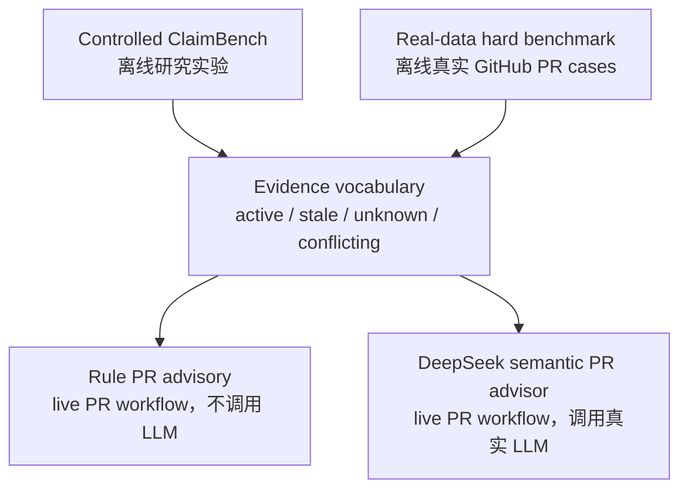

# TraceGate Eval 中文 README

[English README](../README.md)

TraceGate Eval 是一个 v0.3-alpha prototype，用来评估和应用 AI coding agent
在处理历史工程上下文时的证据判断能力。

它关注的不是普通测试通过率，而是一个更窄的问题：当 agent 看到旧的兼容性说明、
历史 Pull Request 摘要、事故记录、回滚原因或维护经验时，它能不能判断这些信息
现在是否仍然有效，并据此做出安全的工程决策。

本仓库里的 `PR` 都指 Pull Request，不是 Public Relations。

## 一句话定位

TraceGate Eval 是一个小型、可复现、真实数据驱动的研究和 advisory prototype，
用于观察 AI coding agent 是否能正确处理历史工程证据：

- 证据仍然有效时，是否保留约束。
- 证据已经过期时，是否允许优化。
- 证据不足时，是否先验证。
- 证据互相冲突时，是否标记冲突并交给人确认。
- 上下文本身有误导时，是否会污染补丁。

它不是在线服务，不是企业级治理平台，不是通用 code review bot，也不是模型排行榜。

## 如何阅读这个仓库

当前仓库包含两条 evaluation track 和两种 advisory mode。

Evaluation tracks:

- Controlled ClaimBench：离线 160-run 研究实验，用来测试历史上下文对
  AI coding-agent 行为的影响。
- Real-data hard benchmark：离线真实 GitHub Pull Request 小型 benchmark，
  当前有 19 条 scored cases，并且 `hard_benchmark_ready=true`。

Advisory modes:

- Rule advisory：不调用 LLM 的 changed-file / `tracegate.yml` live PR
  baseline。
- DeepSeek semantic advisory：调用真实 DeepSeek API 的 live PR semantic
  advisory，目前是 warning-only。

完整结构图见：[PROJECT_MAP.md](PROJECT_MAP.md)。

## 四层结构



四层共用同一套证据状态语言：

| Evidence status | Expected decision | 含义 |
| --- | --- | --- |
| `active` | `preserve` | 当前证据支持历史约束，应保留。 |
| `stale` | `optimize` | 当前证据显示历史约束已经过期，可以优化。 |
| `unknown` | `verify_first` | 证据不足，不应直接做破坏性改动，应先验证。 |
| `conflicting` | `conflict_detected` | 证据互相冲突，需要人工确认或 feature flag。 |

## 当前状态

当前 main 保留 v0.2 hard benchmark，并新增 v0.3 semantic PR advisor。

```text
active=12
stale=2
unknown=3
conflicting=2
scored_cases=19
hard_benchmark_ready=true
```

真实数据与 fallback 状态：

```text
used_real_data=true
used_synthetic_data=false
used_mock_model=false
used_fallback_data=false
```

这些数字来自 `datasets/real_min/cases.jsonl` 和已接受的人工审查标签。当前数据集是
小型 hard mini benchmark，适合验证数据来源、证据状态、label promotion 和 guardrails，
但不具备大规模统计显著性。

## v0.2 和 v0.3 的区别

v0.2-alpha 重点是 real-data hard benchmark readiness：

- 使用公开 GitHub Pull Request 数据。
- 建立 `active` / `stale` / `unknown` / `conflicting` hard labels。
- 区分真实数据、mock、synthetic 和 fallback。
- 达到 `hard_benchmark_ready=true`。

v0.3-alpha 在此基础上新增 live semantic PR advisory：

- 从真实 GitHub PR 收集 metadata、comments、reviews、commits、files、linked
  issues 和有限仓库证据。
- 构建 `EvidencePacket`。
- 调用真实 DeepSeek API。
- 使用 verifier rules 防止 keyword-only conflict misclassification。
- 输出 warning-only Markdown / JSON advisory。
- fork PR 不接收 LLM secrets，并会显式 skip。

## 哪些地方会调用 LLM

| Component | 是否调用 LLM | 离线 benchmark | Live PR workflow |
| --- | --- | --- | --- |
| Controlled ClaimBench | 重新跑模型实验时会；读取已提交报告不会 | 是 | 否 |
| Real-data hard benchmark | 否，普通 validate/run/report 不调用 LLM | 是 | 否 |
| Rule PR advisory | 否 | 否 | 是 |
| DeepSeek semantic PR advisor | 是，通过 DeepSeek API | 否 | 是 |

Rule mode 仍然保留，因为它是确定性的、便宜、适合低信任 PR 场景，也能作为 semantic
mode 的 baseline。它帮助区分：semantic mode 到底是在做证据推理，还是只是做路径匹配。

## 本地快速验证

安装依赖后，可以先跑基础测试：

```bash
python -m compileall .
pytest -q
python -m tracegate guardrails scan --strict
```

如果你的环境里只有 `python3`，可以把上面的 `python` 替换为 `python3`。

查看 CLI：

```bash
python -m tracegate --help
```

## 运行 real-data hard benchmark

验证数据集：

```bash
python -m tracegate data validate \
  --dataset datasets/real_min/cases.jsonl \
  --strict \
  --min-cases 12
```

运行 rule advisor：

```bash
python -m tracegate run \
  --dataset datasets/real_min/cases.jsonl \
  --advisor rule \
  --real-only \
  --no-mock \
  --no-fallback
```

生成报告并跑 guardrails：

```bash
python -m tracegate report \
  --run runs/latest \
  --format markdown,json

python -m tracegate guardrails audit \
  --run runs/latest \
  --strict

python -m tracegate guardrails scan --strict
```

这些命令不应使用 mock、synthetic 或 fallback 数据冒充真实实验结果。

## 运行 DeepSeek semantic PR advisor

Semantic mode 面向真实 GitHub Pull Request。它会构建 EvidencePacket，并调用真实
DeepSeek API：

```bash
python -m tracegate pr analyze \
  --repo owner/name \
  --pr-number 123 \
  --mode semantic \
  --provider deepseek \
  --real-only \
  --no-mock \
  --no-fallback \
  --output runs/pr_advisory/latest/advisory.md \
  --json-output runs/pr_advisory/latest/advisory.json
```

需要在环境变量里配置以下任一凭据：

```text
DEEPSEEK_API_KEY
TRACEGATE_LLM_API_KEY
```

可选配置：

```text
DEEPSEEK_BASE_URL
DEEPSEEK_MODEL
```

如果没有凭据，semantic mode 应该 fail fast，而不是生成 synthetic 或 fallback 结果。

## GitHub Actions semantic advisory

v0.3 的 GitHub Actions workflow 会在同仓库 PR 上运行 semantic advisory。仓库需要配置：

```bash
gh secret set DEEPSEEK_API_KEY --body "$DEEPSEEK_API_KEY"
```

注意事项：

- 不要把 key 打印到日志里。
- fork PR 拿不到 LLM secret，会被显式 skip。
- workflow 使用 `pull_request`，不是 `pull_request_target`。
- semantic advisor 是 warning-only，不会默认阻止 merge。

更多细节见：[SEMANTIC_PR_ADVISOR_v0.3.md](SEMANTIC_PR_ADVISOR_v0.3.md)。

## 主要文件

| 文件 | 用途 |
| --- | --- |
| `README.md` | 英文主 README。 |
| `docs/README_CN.md` | 中文 README。 |
| `docs/PROJECT_MAP.md` | 项目四层结构说明。 |
| `docs/HARD_BENCHMARK_STATUS.md` | v0.2 hard benchmark readiness 状态。 |
| `docs/SEMANTIC_PR_ADVISOR_v0.3.md` | v0.3 DeepSeek semantic advisor 说明。 |
| `docs/DATA_CARD_REAL_MIN.md` | 真实 PR 数据集 data card。 |
| `datasets/real_min/cases.jsonl` | 19 条 scored real cases。 |
| `datasets/real_min/labels/manual_labels.accepted.jsonl` | 人工接受并进入 scored metrics 的 hard labels。 |
| `runs/latest/report.json` | 当前 hard benchmark 最新 JSON 报告。 |

## 数据和安全边界

TraceGate 对真实数据路径有几个明确限制：

- 不把测试 fixture 统计进真实实验。
- 不允许网络失败后自动 fallback 到假数据。
- 不允许空数据生成成功报告。
- 不允许用 mock provider 冒充 real run。
- 不把未通过 provenance 或人工接受流程的 hard labels 加入 scored metrics。

`guardrails scan` 用来检查 mock、fallback、synthetic、敏感信息和输出一致性等风险。
它不能替代人工审查，但能帮助防止明显的 benchmark 污染。

## 结果解读

TraceGate 的结果不只看测试是否通过，还会看 agent 的决策是否符合当前证据：

| Category | Examples |
| --- | --- |
| Execution | patch 是否能应用、测试是否执行并通过。 |
| Semantic | 是否保留有效约束、是否安全优化、是否过度保守。 |
| Evidence | 是否引用了相关证据、是否给出验证计划。 |
| Risk | 是否有破坏性修改、上下文污染、跨模块误改。 |

对 `unknown` 和 `conflicting` cases 来说，空 patch 可能是正确行为：如果证据不足或冲突，
更安全的结果通常是先验证、补证据或交给人判断，而不是直接改代码。

## 当前限制

- 真实数据集仍然很小，不适合当作通用模型排行榜。
- Semantic advisor 不执行 PR 代码，也不替代 human review。
- Evidence retrieval 是有边界的，公开 PR 证据可能不完整。
- Verifier rules 可以阻止一部分过度判断，但不能凭空创造缺失证据。
- 当前仍是 v0.3-alpha prototype，不是企业级平台。

## 推荐阅读顺序

1. [PROJECT_MAP.md](PROJECT_MAP.md)：先理解四层结构。
2. [HARD_BENCHMARK_STATUS.md](HARD_BENCHMARK_STATUS.md)：看 v0.2 hard benchmark 状态。
3. [DATA_CARD_REAL_MIN.md](DATA_CARD_REAL_MIN.md)：看真实数据来源和限制。
4. [SEMANTIC_PR_ADVISOR_v0.3.md](SEMANTIC_PR_ADVISOR_v0.3.md)：看 v0.3 DeepSeek advisor。
5. [../README.md](../README.md)：对照英文主 README。
