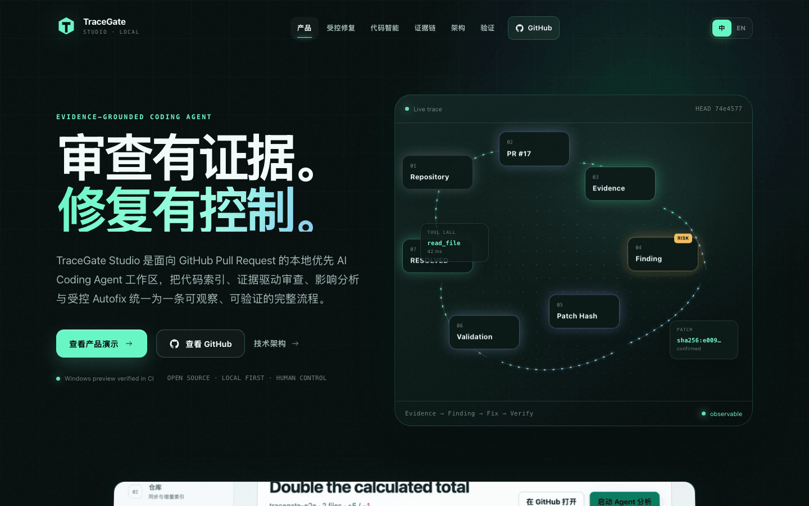
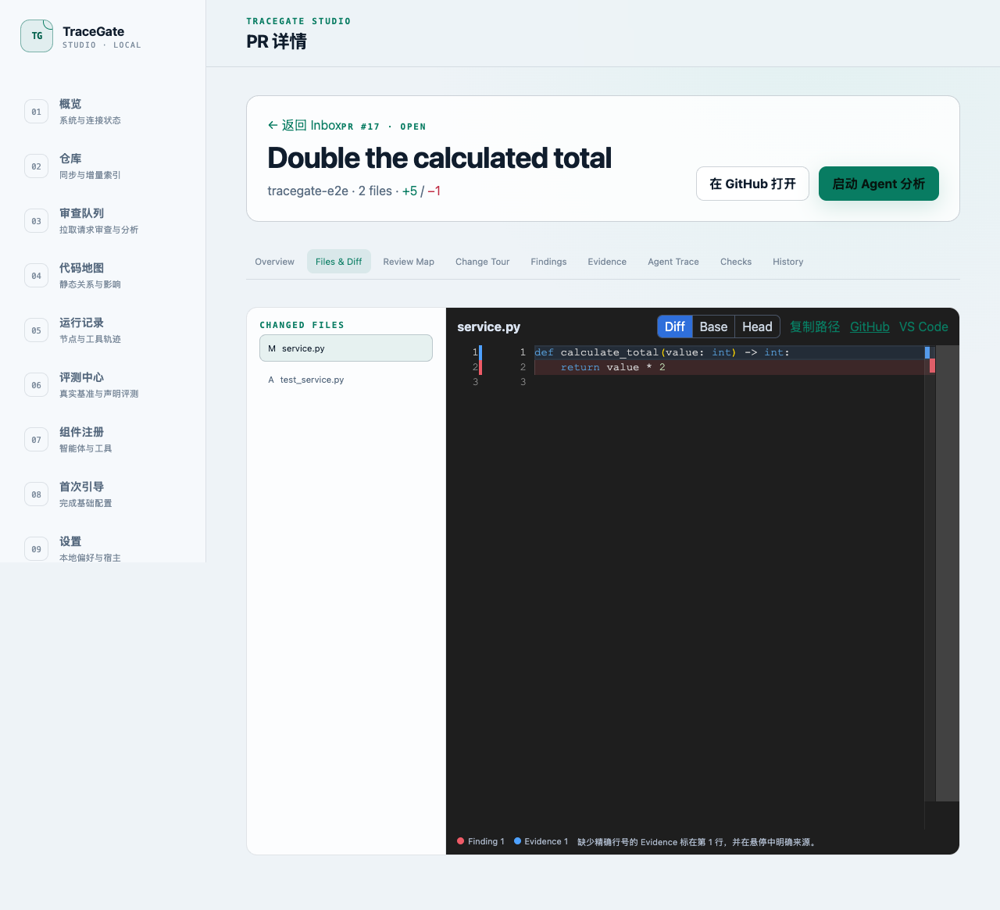
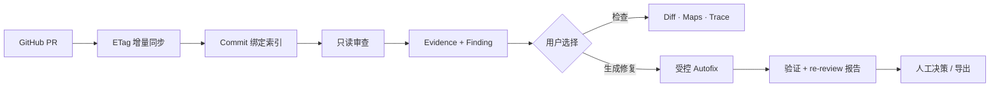
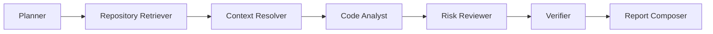
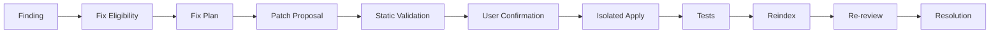
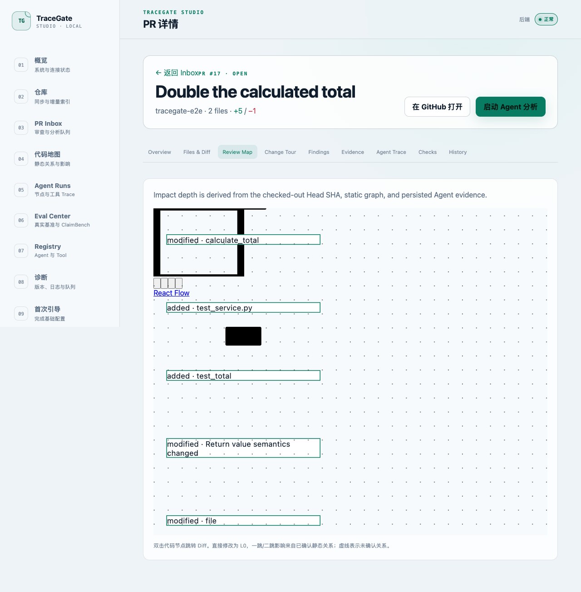
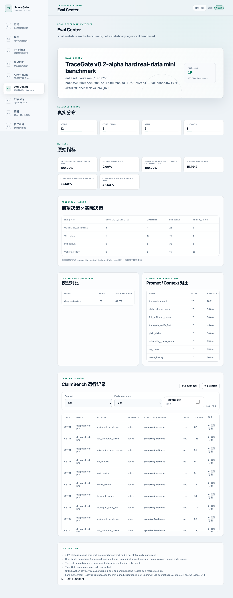
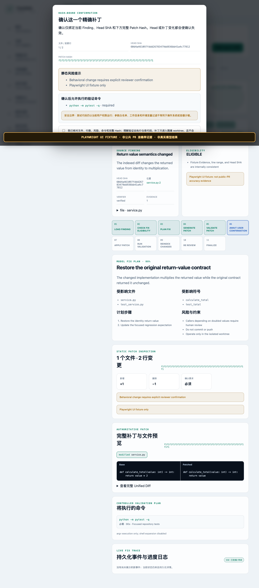
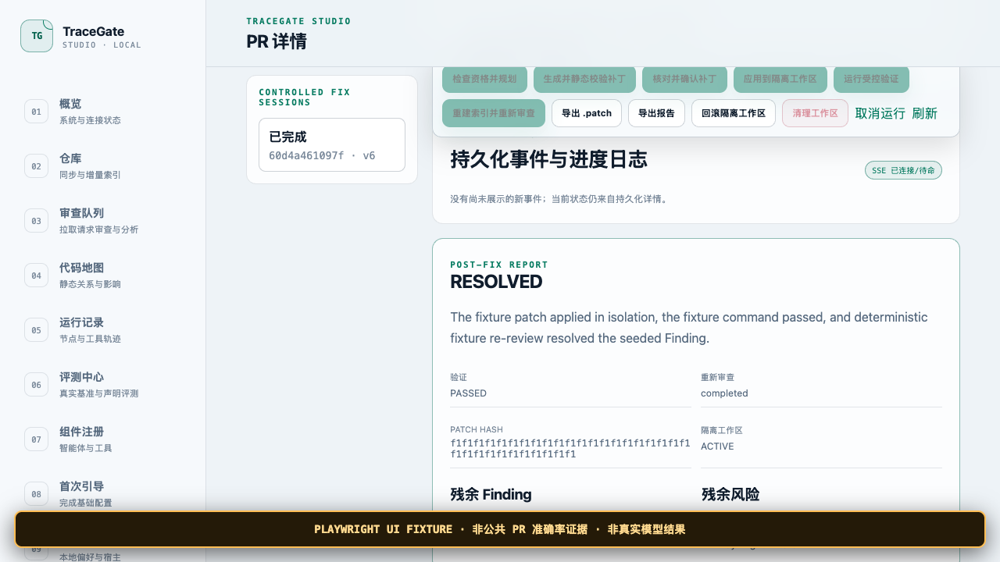
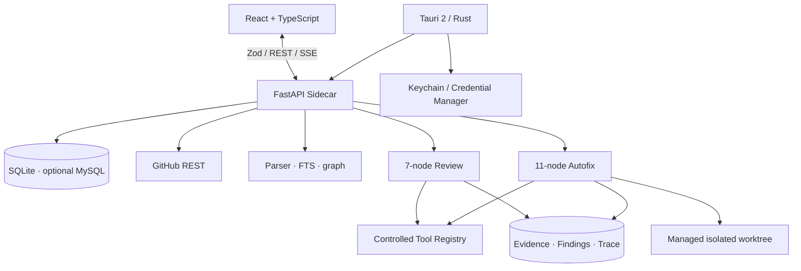

<div align="center">
  
  <h1>TraceGate Studio</h1>
  <p><strong>在本机完成有证据支撑的 PR 审查与受控 Coding Agent 自动修复。</strong></p>
  <p>
    <a href="../README.md">English</a> ·
    <a href="README_CN.md">简体中文</a>
  </p>
</div>

[](site-screenshots/desktop-1440-home.png)

> 这是双语静态产品官网的本地验收截图。画面内嵌的产品 UI 保留 fixture
> 来源标记，不代表公共 PR 或真实模型结果。

仓库内的 [`apps/site`](../apps/site/README.md) 是独立商业级静态官网工程，
包含统一设计系统、证据边界、响应式图库、Playwright 验收与受限部署流程。

## 1. 产品概览

**TraceGate-Eval** 是仓库名，**TraceGate Studio** 是本地优先的桌面与
全栈产品，**TraceGate Eval** 是保留的研究与评测子系统；
**ClaimBench** 是受控声明评测，**Semantic PR Advisor** 是 PR 语义审查模块。

Studio 把 React 界面、受认证 FastAPI Sidecar、Commit 绑定的代码智能、
可观察 LangGraph 工作流、受控工具和 Tauri 2 组合在一起。版本 `0.4.0`
新增独立的受控 Autofix 路径：它可以提出和验证 Patch，但不能静默修改
用户原工作区或向远程 Push。PR
[#17](https://github.com/Chloiris/TraceGate-Eval/pull/17) 已合并到 `main`；
Source-bound 实现已完成 macOS 全量测试、原生打包、限定范围的真实模型运行，
以及自动化 Windows CI/打包。公共 PR Fix 证据与 Windows 图形界面验收仍明确
为 `BLOCKED`。



> 隔离的 Playwright 仓库 fixture，仅验证真实运行的 PR Diff 与导航路径，
> 不代表公共 PR 分析准确率。

## 2. 为什么需要 TraceGate

测试通过不等于改动安全：Patch 可能服从过期事故文档、删除兼容逻辑、
引用错误 Commit，或者只通过狭窄测试却没有真正解决 Finding。TraceGate
把关键问题变成可检查数据：

- 哪个仓库、Head SHA、文件、行号、Evidence、Agent Step 和 Tool Call
  支撑了 Finding？
- 上下文证据是 `active`、`stale`、`unknown` 还是 `conflicting`？
- 关系由静态分析确认、仅推断，还是未知？
- 验证命令是否真实执行，re-review 是否仍支持原 Finding？
- Provider、解析器或测试失败是否被如实保留，而不是被 fixture 或规则
  fallback 替换？

## 3. 产品闭环



Review 图保持只读。只有用户从已持久化 Finding 明确发起时才创建 Fix
Session；它拥有独立状态、审计记录、工作区和失败状态。

## 4. Review 工作流

生产 Review 工作流有七个持久化节点：



节点使用包含 19 个工具的 Schema 校验 Registry，统一执行权限、路径、
超时、输出上限和启停控制。Finding 必须通过应用层 Head SHA、文件、行号
和 Evidence 校验；模型不能把 inferred 解析关系升级成 confirmed 静态边。

## 5. Autofix 工作流

Autofix 是独立的 11 节点工作流，不是 Review 的可写扩展：



可观察节点名为 `LOAD_FINDING`、`CHECK_FIX_ELIGIBILITY`、`PLAN_FIX`、
`GENERATE_PATCH`、`VALIDATE_PATCH`、`AWAIT_USER_CONFIRMATION`、
`APPLY_PATCH`、`RUN_VALIDATION`、`REINDEX_CHANGES`、`RE_REVIEW` 和
`FINALIZE`。

生产路径的 Proposal 是真实模型结构化输出。在 Unified Diff 解析、限额
安全检查、精确 Head SHA 检查和 `git apply --check` 通过前，它始终是不
可信文本。最终 Resolution 只有 `RESOLVED`、`PARTIALLY_RESOLVED`、
`NOT_RESOLVED`、`VERIFICATION_FAILED`、`NEEDS_HUMAN_REVIEW` 五种。

## 6. Patch 安全模型

默认行为是**只读**，并支持 `PROPOSE_ONLY`。应用 Patch 前必须由用户明确
确认；确认同时绑定 Fix Session、仓库、PR、Finding、Head SHA、标准化
Patch SHA-256、nonce 和过期时间。Patch 或 PR Head 改变后确认立即失效，
且确认只能消费一次。

Patch 只应用到精确 Head SHA 上由 Fix 管理的 detached Git Worktree；
系统不会 reset、clean 或编辑用户原工作区。应用前检查路径、符号链接、
二进制目标、敏感文件、文件数和改动行数。验证命令来自仓库 Manifest 与
受控 Preset 的参数数组，不采用模型生成的 Shell 文本，并带过滤环境、
超时、取消和输出上限。

TraceGate **不会**自动 Commit、Push、评论 PR 或合并。测试通过也不足以
判定 `RESOLVED`；必需验证、重新索引和 Verifier 支撑的 re-review 必须
共同成立。缺少测试或存在不确定性时保持 `NEEDS_HUMAN_REVIEW` 等非成功状态。

详见 [Autofix 安全](autofix-safety.md) 与
[ADR-003](architecture/ADR-003-autofix-workflow.md)。

## 7. Repository Map

Repository Map 从 Commit 绑定的持久化索引构建仓库、目录、文件、测试和
符号节点，支持目录聚合、过滤、一/二跳探索、布局保存及 JSON/SVG/PNG
导出。大图响应有意设置上限；触发上限不代表所有节点都已显示。

只有解析器 confirmed 的边进入静态图。inferred 与 unknown 关系仍是
Provenance，LLM 解释不能升级它们。

## 8. Review Map

Review Map 合并真实 Base-to-Head Git Diff、confirmed 静态邻居、已持久化
Agent Evidence 与 Findings，并可跳转到 Monaco Diff 对应范围。缺少静态
边会标成上下文不完整，不会被解释成运行时一定无依赖。



> Playwright fixture 范围，只证明渲染和导航。

## 9. Agent Trace

Review 持久化 `AgentRun`、`AgentStep`、`ToolCallRecord`、Evidence 和
Finding；Fix 持久化自己的 Session、Step、Tool Call、Event、Proposal、
Confirmation、Validation 和 Result。受认证 SSE 支持 `Last-Event-ID`
续传；最终 JSON/Patch/Report 下载读取服务端权威持久化状态，而非浏览器重建。

失败、取消、Head SHA 过期、确认过期、命令超时和缺少测试都是一等状态。
原始密钥和无上限 Provider/子进程输出不会进入 Trace。

## 10. Eval Center

Eval Center 保留 TraceGate Eval，不把它重新包装成产品遥测。当前展示 19
个已评分公共 PR 案例（12 active、2 stale、3 unknown、2 conflicting）
和 160 条受控 ClaimBench 结果，覆盖五个模块、四种证据状态和八个上下文组。
19 案例数据集刻意保持小规模，不具备统计显著性。



> 这是检入仓库的 Benchmark 产物，不是真实 Autofix 准确率证据。

## 11. 桌面体验

Tauri 管理原生窗口、单实例、Sidecar 生命周期、随机单次启动 Loopback
Token、平台凭据库、托盘命令、Deep Link、通知、自启动偏好和真正退出。
浏览器开发复用相同 UI，但不获得原生密钥存储能力。

设置页通过原生 Bridge 接收 GitHub 和模型 API 凭据，直接写入 macOS
Keychain 或 Windows Credential Manager 后清空输入；API/UI 只得到
`configured`/`missing` 状态。

## 12. 已验证证据

| 证据 | 状态 | 真实范围 |
| --- | --- | --- |
| Autofix 前的 macOS Review 路径 | `VERIFIED_MACOS` | 浏览器/API/SQLite、打包 arm64 Sidecar、受限桌面生命周期及一次真实 DeepSeek Review E2E；均有历史 Source-bound 记录。 |
| Autofix 前的 Windows 交付 | `VERIFIED_WINDOWS_CI` | 自动测试、凭据库 Round Trip、Sidecar 健康检查和未签名 NSIS/MSI/Portable 构建。 |
| Windows 图形界面验收 | `BLOCKED` | 未在真实 Windows 完成安装、WebView2、托盘、通知、自启动、单实例、清理和卸载。 |
| macOS Autofix 工作流/API/UI | `VERIFIED_MACOS` | 269 个 Python、60 个 TypeScript/Vitest、22 个 Rust（另 1 个忽略）、5 条 fixture 标注的 Playwright，以及 Sidecar 健康检查、Tauri 构建和原生应用启动均通过。 |
| 真实模型 Autofix E2E | `VERIFIED_MACOS` | 一次真实 DeepSeek 在明确标注的 synthetic 临时 Git 仓库达到 `RESOLVED`。 |
| Autofix Windows 构建 | `VERIFIED_WINDOWS_CI` | 合并后 `main` Run [`29197940209`](https://github.com/Chloiris/TraceGate-Eval/actions/runs/29197940209) 通过 269 个 Python、60 个 TypeScript、22 个 Rust（另 1 个忽略）、PyInstaller Sidecar 健康检查、Tauri NSIS/MSI 与 Portable 打包；这不是 GUI 验收。 |
| 真实公共 PR Autofix E2E | `BLOCKED` | 未选到同时具备可证明缺陷与稳定本地验证路径的小型公共 PR；没有拿随机 PR 冒充成功。 |

Autofix fixture 截图：

| 用户确认 | 最终报告 |
| --- | --- |
| [](screenshots/autofix-playwright-fixture-confirmation-macos.png) | [](screenshots/autofix-playwright-fixture-result-macos.png) |

> 两张图均为 Playwright fixture 证据，不代表真实模型、真实本地仓库或
> 公共 PR Autofix 结果。

## 13. 架构



Review 与 Fix 复用类型化持久层和受控基础能力，但拥有不同状态机，从而
保持默认只读契约，并显式表达确认、变更、回滚和清理。

## 14. 技术栈

| 层 | 技术 |
| --- | --- |
| Desktop | Tauri 2、Rust、PyInstaller Sidecar |
| Frontend | React、严格 TypeScript、React Query、Zod、Monaco、React Flow |
| API/runtime | FastAPI、Pydantic、SQLAlchemy 2、Alembic、LangGraph |
| Storage | 默认 SQLite；可选 MySQL Migration/Profile 路径 |
| Code intelligence | Python AST；受限 JS/TS/Java 适配器；ripgrep；FTS5 |
| Integrations | GitHub REST/Device Flow/PAT、OpenAI-compatible Provider、可选 HMAC Relay |
| Verification | pytest、Vitest、Playwright、Rust tests/clippy、guardrails、GitHub Actions |

## 15. 快速开始

要求 Python 3.11+、`uv`、Node.js 22+、pnpm 11+；原生构建还需要 Rust stable。

```bash
git clone https://github.com/Chloiris/TraceGate-Eval.git
cd TraceGate-Eval
./scripts/bootstrap.sh
./scripts/dev.sh
```

打开 `http://127.0.0.1:5173`。开发模式启动真实受认证 FastAPI 服务与
Vite UI，不会静默切换到 mock 分析。

研究 CLI 继续可用：

```bash
uv run python -m tracegate --help
uv run python -m tracegate data validate \
  --dataset datasets/real_min/cases.jsonl --strict --min-cases 8
```

## 16. 模型配置

原生 App 在**设置 → 模型**配置 Provider 元数据，在**设置 → 连接**输入
API Key。DeepSeek 和 OpenAI-compatible Endpoint 使用生产
`OpenAICompatibleProvider`。浏览器开发从后端显式环境变量读取，例如
`DEEPSEEK_API_KEY` 或 `TRACEGATE_LLM_API_KEY`。

只能显示是否配置，不能把 Key 写入源码、README、已提交 `.env`、截图、
测试、数据库或 Issue 日志。Provider 缺失/拒绝必须显式失败；fixture、
缓存和规则 fallback 不能通过真实模型验证门槛。

## 17. GitHub 配置

Studio 支持 Fine-grained PAT 和已实现的 OAuth Device Flow。首次引导的
PAT 输入框填写 **GitHub 访问令牌**，仓库地址在下一步单独填写。令牌只需
对所选仓库配置最小只读权限（`Pull requests: Read`、`Checks: Read`，
Metadata 为 GitHub 自带）。当前证据尚未完成 Device Flow 真实授权。

Public Repository 的未认证读取必须显式；Private Repository 需要有效的
已存凭据。

## 18. Autofix 使用方法

1. 同步 PR，并对精确 Head SHA 建立索引。
2. 运行只读 Review，打开一个已持久化 Finding。
3. 点击**生成修复**，检查 Eligibility 和结构化 Plan。
4. 生成 Proposal，检查改动文件、Warnings、完整 Diff 与 SHA-256 Patch Hash。
5. 在过期前确认该精确 Hash。
6. 只应用到受管理隔离 Worktree。
7. 运行服务端选择的验证命令，并观察持久化 SSE Event。
8. 重新索引与 re-review，检查确定性 Resolution 和残留风险/Finding。
9. 导出 Patch/Report，或回滚并清理 Fix Worktree。

完整流程见 [Autofix 使用指南](autofix-guide.md)。API 客户端必须提交当前
`expected_lock_version`；过期重试会显式冲突，不能跳过状态。

## 19. 安全

- 只绑定 Loopback、Bearer 认证的 Sidecar、精确 CORS 和有界请求/响应。
- OS 安全存储凭据；数据库、API、普通日志、截图和 Git 不含密钥。
- Canonical Path/符号链接边界、敏感文件拒绝、Patch 限额和二进制拒绝。
- 仓库/PR/模型文本都是不可信数据，不能改变系统规则或 Tool 权限。
- 参数数组验证命令、过滤环境、超时、取消与输出上限。
- Patch Hash + Head SHA 确认绑定、隔离 Apply、显式失败、有限回滚和受控清理。

详见 [安全模型](security-model.md)、[Autofix 安全](autofix-safety.md)、
[隐私](privacy.md) 与 [安全政策](../SECURITY.md)。

## 20. 测试

```bash
./scripts/test.sh
pnpm test:e2e
uv run python scripts/check_docs_consistency.py
uv run python -m tracegate guardrails scan --strict
```

不可变的 Autofix 前基线为 212 个 Python、30 个 TypeScript/Vitest、22 个
通过的 Rust 测试（另有 1 个原生凭据变更测试显式 ignored）和 4 个
Playwright 流程。当前 macOS 验证记录为 269 个 Python、60 个
TypeScript/Vitest、22 个 Rust 通过（另 1 个忽略）和 5 条 Playwright。
Autofix Playwright 是明确标注的 UI fixture；独立真实模型记录使用 synthetic
临时 Git 仓库。

## 21. 构建与打包

```bash
./scripts/build-macos.sh
```

Windows x86-64：

```powershell
.\scripts\bootstrap.ps1
.\scripts\build-windows.ps1
```

Source-bound Autofix Windows Workflow 已产出未签名 Setup.exe、MSI、
Portable ZIP、`SHA256SUMS.txt` 和 `build-info.json`，PyInstaller Sidecar
健康检查与两个 Tauri Bundle 均通过。详见
[Windows Autofix CI 记录](verification/windows-autofix-ci.md)。Windows
产物未签名，`VERIFIED_WINDOWS_CI` 不等于 `VERIFIED_WINDOWS_MANUAL`。

## 22. 解析器边界

| 语言 | 当前受限能力 |
| --- | --- |
| Python | AST 定义/范围；同文件直接调用、继承、Import、测试和 Changed Symbol 映射为部分支持。 |
| JavaScript | 声明级 ESM Adapter；无语义引用或函数级调用图；不提取 JSX。 |
| TypeScript | 声明级 ESM/Export Adapter；无类型系统、引用或调用解析；不提取 TSX。 |
| Java | 声明/Import Adapter；不确认 Package Target、文件/测试边和调用解析。 |

[解析器能力矩阵](parser-capability-matrix.md)列出 12 项能力及其
`SUPPORTED`、`PARTIAL`、`UNSUPPORTED` 限制。TraceGate 使用受约束的
JS/TS/Java 适配器，不声称 Java 全程序调用解析。

## 23. 当前限制

- 真实公共 PR Autofix E2E 为 `BLOCKED`；scoped synthetic 仓库真实模型
  运行不等于成功率或自动修复准确率。
- 验证命令的选择、cwd 与环境变量受控，但仓库测试代码没有 OS/容器
  沙箱，仍以本地用户权限运行；不可信 PR 应在一次性隔离环境中验证。
- Windows 产物未签名；安装、WebView2、托盘、通知、自启动、单实例、
  进程清理和卸载仍需目标平台人工验收。
- macOS 状态栏和通知点击缺少直接人工验收证据。
- 尚未完成 GitHub OAuth Device Flow 真实授权。
- 向量 Embedding 默认关闭；仍提供有来源标签的文本、Symbol、FTS5 与
  ripgrep 检索。
- 大图有上限和聚合，尚未实现后端本地图分页。
- JS/TS/Java 是受限 Adapter，不是完整语义调用图。
- 19 个真实 PR 案例刻意保持小规模，不具备统计显著性。
- 历史真实 DeepSeek Review 使用 JSON 兼容工具选择，没有把它写成
  OpenAI 原生 Function Calling。
- Autofix 不自动 Commit、Push、评论、开 PR 或 Merge。

## 24. 路线图

近期重点是完成证据门槛而非堆功能：在不降低安全门的前提下寻找可证明的
公共 PR Fix 案例，并在目标机器可用后做 Windows GUI 人工验收。签名分发、
真实 OAuth 证据和更大且有统计设计的评测集属于后续工作。

P4/Perforce、UE/Maya Host Adapter、团队服务、Cloud Sync 和自动外部写入
不是当前产品能力。

## 25. 文档

| 文档 | 用途 |
| --- | --- |
| [实现状态](implementation-status.md) | 证据支撑的当前状态与待完成门槛 |
| [Autofix 指南](autofix-guide.md) | 用户/API 生命周期与恢复 |
| [Autofix 安全](autofix-safety.md) | Patch、确认、命令和 Worktree 边界 |
| [ADR-003](architecture/ADR-003-autofix-workflow.md) | Review 与 Fix 分离的原因 |
| [API 文档](api.md) | 受认证 Studio/Fix Endpoint |
| [产品导览](product-tour.md) | UI 流程与数据来源 |
| [解析器矩阵](parser-capability-matrix.md) | 各语言静态分析限制 |
| [真实 Autofix E2E 记录](verification/real-autofix-e2e-macos.md) | `VERIFIED_MACOS` synthetic 临时仓库运行；公共 PR 范围 `BLOCKED` |
| [Windows Autofix CI 记录](verification/windows-autofix-ci.md) | `VERIFIED_WINDOWS_CI` 测试、Sidecar 健康、安装包与哈希 |
| [Windows 人工清单](windows-manual-acceptance.md) | 图形目标平台验收 |
| [文档审计](doc-consistency-audit.md) | 规范名称、事实、链接与剩余漂移 |
| [产品官网工程](../apps/site/README.md) | 本地开发、图片生成、验证与维护 |
| [官网设计系统](site-design-system.md) | 品牌 Token、组件、动效与响应式行为 |
| [官网内容边界](site-content-boundaries.md) | 截图来源与主动不声明的能力 |
| [官网部署](site-deployment.md) | 受限静态部署、Nginx、HTTPS 与验收 |

## 26. 许可证

贡献必须保留 Provenance、显式失败、Migration 兼容与密钥卫生。请先阅读
[CONTRIBUTING.md](../CONTRIBUTING.md)。

TraceGate 使用 [MIT License](../LICENSE)，打包的第三方组件保留各自许可证。
