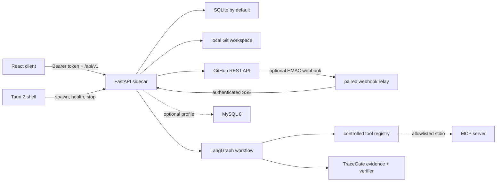

# ADR-001: TraceGate Studio full-stack architecture

- Status: Accepted for incremental implementation
- Date: 2026-07-10
- Decision owners: TraceGate maintainers
- Target branch: `feat/tracegate-studio-fullstack`

## Context

TraceGate currently ships a Python research package, command-line interface,
checked-in ClaimBench and real-PR evaluation results, a lightweight FastAPI
dashboard, a rule PR advisory, and a DeepSeek semantic PR advisor. The product
brief adds a local-first desktop product that monitors GitHub Pull Requests,
indexes repositories, runs an observable coding-agent workflow, and connects
every finding to current-commit evidence.

The new product must not replace or reinterpret the existing benchmark. It must
reuse the existing evidence vocabulary (`active`, `stale`, `unknown`, and
`conflicting`), EvidencePacket, verifier, guardrails, result loaders, and real
experiment artifacts. It must also keep the existing CLI and published report
paths compatible while the Studio surface is built.

Development is Mac-first on Apple Silicon. Windows x86_64 binaries are built on
a Windows GitHub Actions runner. A successful Windows build is not evidence of
manual installation, tray, notification, autostart, or uninstall behaviour.

## Decision

TraceGate Studio will be added incrementally to the existing repository. The
existing `tracegate` Python package remains the source of benchmark and evidence
truth. The repository will gain the following boundaries:

```text
apps/web/                 React + TypeScript browser/WebView client
apps/desktop/             Tauri 2 shell and platform lifecycle code
packages/api-client/      generated or schema-checked TypeScript API client
packages/shared-types/    cross-client TypeScript domain types
services/webhook-relay/   optional authenticated GitHub relay (P2)
tracegate/studio/         FastAPI application and Studio domain services
tracegate/agent/          observable LangGraph workflow
tracegate/github/         GitHub provider and polling
tracegate/indexing/       parsers, incremental index and retrieval
tracegate/graph/          repository/review graph construction
tracegate/tools/          validated, policy-controlled tool registry
alembic/                  versioned SQLite/MySQL schema migrations
```

Names may be collapsed where a package would otherwise contain only an
`__init__.py`, but the ownership boundaries remain.

### Runtime topology



The sidecar listens only on `127.0.0.1`, selects an available port, and
requires a per-launch bearer token. The token is delivered to the Tauri client
through a narrow command, is never persisted in normal logs, and is not exposed
by status or diagnostic responses. Browser development uses an explicitly
configured development token and origin.

### Frontend

- React, strict TypeScript, Vite, pnpm, TanStack Query, Zustand, Zod, React
  Flow, a bounded deterministic layered layout, and Monaco are the initial
  stack. ADR-002 records why ELK was removed after bundle measurement.
- The UI talks only to the versioned API client; it never receives a GitHub or
  model provider secret.
- `HostBridge` isolates browser and Tauri capabilities. UE and Maya adapters
  remain interfaces only until real host code and tests exist.
- Graph node and edge models use discriminated unions. Graph relationships are
  built by static analysis and Git evidence; an LLM may explain but may not
  invent them.

### Backend and data

- FastAPI routes are versioned below `/api/v1`; existing `/api/*` benchmark
  routes remain available during migration.
- SQLAlchemy 2 repositories own persistence. SQLite with FTS5 is the zero-
  configuration desktop default. Alembic owns every schema change.
- A MySQL 8 profile is optional and must pass a migration/integration smoke test
  before being advertised as verified.
- SQLite uses FTS5/bm25; MySQL uses an explicit `FULLTEXT(path, content)` index
  and `MATCH ... AGAINST`. Dialect-specific migration SQL is compiled in CI and a
  MySQL 8.4 service runs the same smoke path before the profile can advance to
  Windows/server verification.
- Long-running work is outside request handlers. API handlers enqueue or query
  application services, and SSE streams durable run events.
- Core searchable fields are columns. JSON is limited to provider payloads,
  bounded extension metadata, and immutable event snapshots.

### Agent and tools

- LangGraph runs the real analysis path. Planned nodes are ingest, planner,
  repository retriever, context resolver, code analyst, risk reviewer,
  verifier, and report composer.
- Each node writes structured input/output metadata, latency, error and retry
  state. Cancellation is checked between nodes and during cancellable tools.
- Pydantic models define workflow state, findings, evidence and every tool
  argument. Model output is validated before persistence.
- Tools are deny-by-default, repository-scoped and assigned one of
  `SAFE_READ`, `REPOSITORY_READ`, `COMMAND_RESTRICTED`, `WRITE_CONFIRMATION`,
  `NETWORK`, or `DESTRUCTIVE_FORBIDDEN`.
- `run_command` uses an argument-vector allowlist, a filtered environment,
  bounded output and timeouts. `apply_patch` is disabled unless the user has
  enabled write mode; commit, review comment and push remain separately
  confirmed operations.
- The optional MCP adapter is sequential JSON-RPC over a controlled stdio
  executable. It negotiates a supported protocol version, exposes only an
  explicit tool allowlist, filters the child environment, bounds messages and
  time, and never launches through a shell.

### Existing capability reuse

| Existing capability | Source | Studio use |
| --- | --- | --- |
| Claim/evidence states | `tracegate/claims`, `tracegate/core/models.py` | Memory and evaluation vocabulary |
| EvidencePacket and redaction | `tracegate/pr_advisor/evidence_packet.py` | PR evidence ingestion and prompt boundary |
| Semantic verifier | `tracegate/pr_advisor/verifier.py` | Finding/evidence verification node |
| DeepSeek real-call client | `tracegate/pr_advisor/deepseek_client.py` | First ModelProvider adapter |
| Semantic judge | `tracegate/pr_advisor/llm_judge.py` | Structured-output compatibility reference |
| Public GitHub evidence collection | `tracegate/pr_advisor/collect.py`, `retrieve.py` | GitHubProvider seed implementation |
| Reality guardrails | `tracegate/core/guardrails.py` | CI and production-path audits |
| ClaimBench and real-data reports | `tracegate/runners`, `tracegate/metrics`, checked-in reports | Eval Center data source |

Studio adapters may wrap these modules, but do not duplicate their status
definitions or silently convert rule output into semantic model output.

### Index and graph truth

The index version is bound to repository ID and commit SHA. Changed files are
derived from Git, content hashes decide reparse work, and deletion removes stale
symbols and edges. Search combines path lookup, ripgrep, symbol lookup, FTS5,
changed-hunk priority, graph neighbours, Git history and PR evidence. Embeddings
are optional and visibly disabled when no embedding provider is configured.

The initial parser capability matrix is recorded per language and level. A
partial Java import/symbol implementation may not be described as a precise
global Java call graph.

### Desktop and platform boundary

Rust owns window, single-instance, tray, notification, autostart, deep-link,
secure-storage and sidecar process lifecycle only. Business analysis remains in
Python. Platform differences live in isolated Rust modules selected with
`cfg(target_os = ...)`, not scattered string comparisons.

Sidecar names are platform-specific:

- macOS arm64: `tracegate-backend-aarch64-apple-darwin`
- Windows x86_64: `tracegate-backend-x86_64-pc-windows-msvc.exe`

PyInstaller runs natively on each target OS. macOS output is never renamed or
reported as a Windows executable.

Official Tauri v2 notification and autostart plugins are called behind native
commands exposed by `TauriHost`. BrowserHost intentionally has neither
capability. Notification text is bounded before crossing the native boundary;
autostart remains opt-in and defaults off. Compiling this code on macOS is not
evidence that Windows notification or login behavior passed manual acceptance.

The optional relay is a separate failure domain. It validates the exact GitHub
body with HMAC-SHA256, deduplicates delivery IDs, pairs a device once to an
explicit repository allowlist, stores only device-token digests, and exposes an
authenticated bounded-metadata SSE stream. Internet deployment requires TLS;
loopback compose execution is not presented as a public production relay.

## Security decisions

- Repository files, comments, PR descriptions and model output are untrusted
  data, never executable instructions.
- Canonical path and symlink checks prevent access outside an enrolled
  workspace. Known credential paths and sensitive patterns are denied.
- Provider credentials use platform secure storage in packaged mode and are
  redacted from logs, API models and traces.
- Local API CORS is allowlisted; packaged mode accepts only the Tauri origin and
  authenticated requests.
- Network, command and write tools are separate permissions. Destructive Git
  history operations are forbidden.
- Webhooks require GitHub HMAC verification and delivery-ID deduplication.

## Delivery and evidence policy

Implementation status uses only the states defined in
`docs/implementation-status.md`. Tests, build artifacts, logs, API responses,
database rows, screenshots or Git commits are required before a feature is
reported complete. Windows CI evidence never becomes
`VERIFIED_WINDOWS_MANUAL` without a real Windows GUI acceptance record.

## Alternatives considered

### Replace the repository with a new monorepo

Rejected because it would make benchmark history, reports and provenance easy
to break or silently fork. Incremental boundaries preserve compatibility.

### Electron desktop shell

Rejected for this project because Tauri provides a smaller native shell and a
clear Rust process-lifecycle boundary. This choice adds Rust/toolchain and
WebView2 acceptance work, which is tracked explicitly.

### Put all desktop behaviour in Python

Rejected because single-instance, tray, deep links, secure storage and child
process cleanup need reliable platform integration. Python remains the domain
runtime and Rust remains the shell.

### Generate graph relationships with an LLM

Rejected because graph truth must be reproducible and commit-bound. LLM output
can annotate confidence and explain evidence, not create dependency facts.

### Webhooks as the only monitoring mode

Rejected because a local desktop app usually has no stable public endpoint.
ETag-aware polling is the complete default; the relay is an optional P2 mode.

## Consequences

The repository temporarily contains both the legacy benchmark dashboard and
the new React client. This is intentional during migration. CI and local setup
become heavier, and packaged desktop verification has distinct macOS,
Windows-CI, and Windows-manual gates. In exchange, benchmark provenance remains
intact and every product claim can be tied to a platform-specific artifact.

## Follow-up ADRs

Material changes to the database engine boundary, parser strategy, sidecar
transport, credential store, workflow framework, or repository layout require a
new ADR rather than silently revising this decision.
