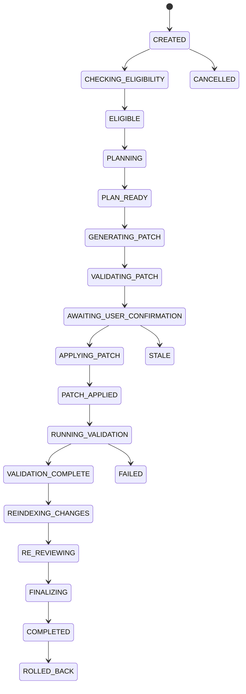

# TraceGate Studio controlled Autofix guide

- Applies to: version `0.4.0` feature implementation
- Default mode: read-only review; Fix requires an explicit user action
- Evidence status: `VERIFIED_MACOS` for the full local suite, packaged/native
  macOS path and one real DeepSeek synthetic temporary-repository run; public
  PR Fix E2E remains `BLOCKED`

Autofix starts from a persisted, verifier-backed Finding. It does not accept a
free-form request to edit an arbitrary repository, and it does not turn the
seven-node Review workflow into a mutable workflow.

## Lifecycle

The diagram shows the normal path plus representative terminal paths; the
server-side state machine is authoritative and rejects skipped transitions.
Every mutable API action also checks `expected_lock_version` so stale clients
cannot overwrite a newer transition.

## Before starting

1. Enroll a repository and authorize an absolute local Git workspace.
2. Synchronize the selected Pull Request.
3. Check out/fetch the exact PR Head externally and build a matching index.
4. Configure a real OpenAI-compatible provider for production Fix Plan/Patch/
   re-review generation. Provider absence remains a visible error.
5. Complete read-only review and select a persisted Finding with current
   Evidence and a matching Head SHA.

The eligibility step rejects or withholds automatic repair for stale Head/
index identity, missing Evidence, invalid line ranges, unsupported or binary
targets, sensitive paths, and policy/risk conditions. A force flag does not
disable hard safety boundaries.

## User flow

### 1. Create and plan

From a Finding, choose **Generate Fix**. Studio creates a Fix Session bound to
repository, PR, Finding, source Agent Run, base/head SHA, and index version. It
then produces a structured plan containing objective, root cause, affected
files/symbols, constraints, steps, expected behavior, validation strategy,
risk notes, and confidence.

Planning may use the production read-only Registry. Tool Calls remain separate
auditable rows; repository text is data and cannot change tool permission.

### 2. Generate and inspect the proposal

The model returns a structured Patch Proposal with one unified diff. Before it
is shown as confirmable, the server:

- normalizes line endings and computes SHA-256 over the normalized patch;
- verifies the proposal's Finding/base/head identity;
- parses diff headers and changed paths;
- checks file/line limits and sensitive/binary/symlink boundaries;
- classifies deletion, lockfile, configuration, CI, auth, and security risk;
- verifies the exact Git Head and clean managed worktree;
- runs `git apply --check` in that worktree.

The Patch Hash in the UI is the authoritative server value. Download uses
`GET /api/v1/fix-sessions/{id}/patch?download=true` and returns the same
persisted content with `X-TraceGate-Patch-Hash`.

### 3. Confirm the exact patch

Confirmation binds the current session/repository/PR/Finding/Head SHA/Patch
Hash and expires after the configured TTL (default 900 seconds). It is
single-use. A changed patch, changed PR Head, expired confirmation, invalid
nonce, or mismatched hash blocks apply and surfaces a stable error.

### 4. Apply in isolation

The default mutable mode is `APPLY_IN_ISOLATED_WORKSPACE`. TraceGate creates a
detached Git worktree under its managed Autofix data root at the exact Head
SHA. It applies only the confirmed patch there. The enrolled source workspace
is never reset, cleaned, or edited—even when it has uncommitted user changes.

`PROPOSE_ONLY` intentionally stops before mutation.

### 5. Validate

`ValidationCommandResolver` derives commands from checked-in manifests,
existing package scripts, and controlled presets. Model-proposed shell text is
never executed. Commands are argument arrays, use the isolated worktree as
their root, and run with an environment allowlist, timeout, cancellation, and
bounded stdout/stderr summaries.

If the repository has no recognized real test command, the result is explicit
`NO_TEST_COMMAND_AVAILABLE`; lint/typecheck alone do not count as a test. A
required failure prevents `RESOLVED`.

### 6. Reindex, re-review, and resolve

Studio creates a transient Fix-workspace index keyed by Head SHA and Patch Hash
without replacing the repository's primary current index. Re-review receives
the applied diff, validation results, original Finding/Evidence, new Evidence,
and the transient index.

The deterministic resolution policy—not the model alone—selects:

| Resolution | Meaning |
| --- | --- |
| `RESOLVED` | Patch applied; required tests passed; reindex completed; verifier no longer supports the original Finding; no disqualifying new risk. |
| `PARTIALLY_RESOLVED` | Some risk changed, but residual Finding/risk remains. |
| `NOT_RESOLVED` | Re-review still supports the original Finding. |
| `VERIFICATION_FAILED` | Required validation or required verification failed. |
| `NEEDS_HUMAN_REVIEW` | Evidence, tests, parser certainty, or safety confidence is insufficient for a stronger claim. |

### 7. Export, rollback, and cleanup

The final report contains Patch Hash, commands and return codes, validation
status, re-review summary, resolution, residual Findings, residual risks, and
final diff metadata. Patch and JSON report exports never imply a commit/push.

Rollback hard-resets and cleans **only the Fix-owned worktree** to the recorded
Head SHA. Cleanup deletes only the registered managed worktree. Diagnostics
lists retained/failed/orphaned worktrees under the managed root and applies the
configured retention boundary (default 24 hours).

## API sequence

All routes require the local bearer token. Create is idempotent through the
API's request-id mechanism; actions require current `expected_lock_version`.

| Step | Method and route |
| --- | --- |
| Create | `POST /api/v1/fix-sessions` |
| List/detail | `GET /api/v1/fix-sessions`; `GET /api/v1/fix-sessions/{id}` |
| Plan | `POST /api/v1/fix-sessions/{id}/plan` |
| Generate | `POST /api/v1/fix-sessions/{id}/generate` |
| Confirm | `POST /api/v1/fix-sessions/{id}/confirm` |
| Apply | `POST /api/v1/fix-sessions/{id}/apply` |
| Validate | `POST /api/v1/fix-sessions/{id}/validate` |
| Re-review/finalize | `POST /api/v1/fix-sessions/{id}/re-review` |
| Live/resumable events | `GET /api/v1/fix-sessions/{id}/events` |
| Patch/report | `GET /api/v1/fix-sessions/{id}/patch`; `GET /api/v1/fix-sessions/{id}/report` |
| Cancel/rollback | `POST /api/v1/fix-sessions/{id}/cancel`; `POST /api/v1/fix-sessions/{id}/rollback` |
| Delete workspace | `DELETE /api/v1/fix-sessions/{id}/workspace` |
| Workspace diagnostics | `GET /api/v1/fix-workspaces` |
| Diagnostic recovery cleanup | `DELETE /api/v1/fix-workspaces/{id}` |

SSE persists sequence IDs. Clients reconnect with `Last-Event-ID`; duplicate
events are ignored by the typed client and a bounded parser rejects unbounded
or malformed streams.

## What Autofix never does

- It never edits the enrolled source workspace by default.
- It never reads denied credentials or patches `.env`, SSH/cloud credential
  files, database files, logs, or other configured sensitive targets.
- It never executes arbitrary Shell or a model-supplied command string.
- It never treats fixture, mock, cache, or a rule fallback as a real-model run.
- It never commits, pushes, comments, opens an external PR, or merges.
- It never marks a failed/absent test or uncertain re-review as `RESOLVED`.

See [Autofix safety](autofix-safety.md),
[API reference](api.md), and the
[real-model E2E record](verification/real-autofix-e2e-macos.md).
