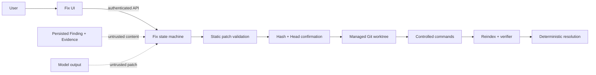

# Controlled Autofix safety model

- Last reviewed: 2026-07-12
- Default: Review is read-only; Fix requires explicit initiation and
  hash-bound confirmation
- Scope: proposal, confirmation, isolated worktree, validation, re-review,
  rollback, cleanup, API, SSE, and persisted Fix records

This document describes enforced boundaries in the version `0.4.0` Autofix
implementation. It does not claim that a generated patch is correct. The final
real-model and cross-platform verification status is tracked in
[`implementation-status.md`](implementation-status.md).

## Trust boundaries



PR descriptions, comments, README text, source comments/strings, test fixtures,
generated files, model rationale, unified diffs, subprocess output, and model
tool-selection text are all untrusted input. None can change system rules,
grant Tool permission, expand repository scope, or authorize mutation.

## Threat/control matrix

| Threat | Enforced control | Failure boundary |
| --- | --- | --- |
| Malicious PR text / prompt injection | System policy is outside repository context; strict Pydantic output; application-side identity/path/Evidence checks; Registry permissions | Invalid output or unsupported action fails visibly; no rule fallback |
| Model-generated malicious patch | Diff parser, exact proposal identity, file/line limits, risk warnings, sensitive/binary rejection, `git apply --check` | Proposal never becomes confirmable |
| `../` or absolute path | Pure relative-path parsing plus canonical `RepositoryBoundary` containment | Stable patch/path error |
| Symlink escape | Resolve target and require containment in managed worktree/repository boundary | Target rejected before apply |
| Sensitive file mutation | Deny `.env`, SSH keys, cloud credentials, key/certificate/database/log/privacy patterns | Target rejected; no override setting |
| Patch replacement after review | SHA-256 over normalized patch bound into confirmation and rechecked at apply/export | Hash mismatch invalidates confirmation |
| Expired/replayed confirmation | Nonce hash, TTL, exact session/repository/PR/Finding/Head/patch binding, single-use consumption | Apply denied |
| PR Head changes | Compare current PR Head before confirmation, apply, validation, reindex, re-review, and finalization | Session becomes `STALE`; no later `RESOLVED` |
| User workspace damage | Detached worktree at exact Head; reset/clean/rollback only allowed below managed Autofix root | Original workspace remains unchanged |
| Arbitrary shell / command injection | Resolver emits argument vectors from manifests/presets; no shell; executable/script allowlists | Command refused; no model-command fallback |
| Environment-variable leakage | Minimal filtered environment, synthetic managed `HOME`, credential variables excluded | Provider/GitHub env values are not passed; this is not an OS sandbox and repository code may still access resources available to the user |
| Output or runtime exhaustion | Per-command timeout, cancellation, POSIX process-group termination where available, Windows parent-process termination, byte cap, persisted summaries | `CANCELLED` or failed validation; Windows descendant termination is a documented limitation |
| False success | Required tests + applied diff + transient index + re-review + deterministic policy | Missing/failed evidence cannot yield `RESOLVED` |
| Automatic external mutation | No commit, push, comment, PR creation, merge, or force-push path | Export only; user performs external Git action separately |
| Worktree accumulation | Persistent cleanup state, bounded retention, diagnostics, registered-root checks | Residual workspace remains visible |

## Confirmation integrity

The authorization unit is not a button click alone. A confirmation covers:

```text
Fix Session ID
+ Repository ID
+ Pull Request ID
+ Finding ID
+ exact Head SHA
+ SHA256(normalized unified diff)
+ nonce hash
+ expires_at
```

Every component is checked again at apply. Patch line-ending normalization
makes the hash deterministic; it does not relax path or content validation.
Confirmation is consumed atomically when apply starts and cannot be reused.

Optimistic `lock_version` checks prevent two browser tabs or retried requests
from racing state transitions. Idempotency prevents safe retries from creating
duplicate transitions but never makes a different payload equivalent.

## Patch boundaries

Default configurable limits are eight files and 800 changed lines. Hard safety
rules cannot be disabled in Settings. Validation rejects:

- non-unified, combined, binary, quoted, absolute, traversal, NUL-containing,
  duplicate/ambiguous, or structured-proposal-mismatched paths;
- targets that escape through a symlink;
- sensitive and binary targets;
- a repository/worktree whose HEAD differs from the Fix-bound SHA;
- a dirty managed worktree before application;
- any patch that fails `git apply --check`.

Deletions and changes to lockfiles, CI, configuration, authentication, or
security code are warning-bearing/high-risk operations and remain visible to
the user. A future override must not bypass canonical path, sensitive-file,
hash, Head-SHA, or isolation boundaries.

## Validation command provenance

The model may recommend a validation strategy as text, but it cannot provide
the executable command that the Sidecar runs. `ValidationCommandResolver`
inspects repository manifests and known scripts/presets. The executor:

- uses `create_subprocess_exec`, not `shell=True`;
- validates executable and arguments;
- roots `cwd` in the Fix worktree;
- removes provider/GitHub credentials and other unapproved variables;
- enforces timeout, cancellation, bounded output, and return-code persistence;
- records purpose, source, required flag, duration, truncation, and error code.

These controls constrain command selection; they do not sandbox the code that
pytest, npm, Maven, Gradle, or Cargo executes. Repository tests run with the
TraceGate process user's filesystem and network authority. They may try to read
files outside the worktree, contact the network, or invoke local services such
as Keychain. The confirmation UI therefore names this boundary and requires an
explicit acknowledgement. Do not run validation for an untrusted public PR on
a sensitive workstation; use a disposable VM/container or review and export the
patch without executing tests.

The workflow hashes the complete changed/deleted/untracked worktree state before
validation and checks it after every command. A command that changes that state
is failed and the approved patch state is restored. Reindex cache identity and
the final report use the actual worktree state/full diff, not only the model's
structured file list.

Lint/typecheck may supplement tests but do not become proof that tests exist.
`NO_TEST_COMMAND_AVAILABLE` is explicit and normally leads to
`NEEDS_HUMAN_REVIEW`.

## Re-review and resolution

Re-review sees the actual full applied diff and a transient worktree index; it does
not reuse the pre-patch index as if code were unchanged. Model assessment is
one input. Deterministic policy requires application, required validation,
reindex, an actual content-hash change on the Finding path, a passing directed
test related to that path, original-Finding verifier state, and new-risk checks
before `RESOLVED`. Model re-review is explicitly advisory.

Test success can still produce `NEEDS_HUMAN_REVIEW` when parser coverage,
Evidence, scope, or re-review confidence is insufficient. A verifier/model
failure is not converted to success.

## Rollback and cleanup

Rollback is bounded to the registered Fix worktree and recorded Head SHA. It
does not rewrite the enrolled workspace or remote Git history. Cleanup confirms
that the path is a child of the managed Autofix root and not an active
operation before deletion. Failures persist as cleanup state rather than being
hidden.

The product does not promise crash-free automatic deletion. Diagnostics and
retention collection make residual worktrees inspectable and recoverable.

## Security regression matrix

Automated coverage must include:

- patching `.env`, SSH key paths, cloud credentials, database/log files;
- `../`, absolute paths, binary patches, and symlink escape;
- file/line limit overflow and structured changed-file mismatch;
- Patch Hash mismatch and replacement after confirmation;
- confirmation expiry/reuse and PR Head change;
- command separators/substitution and executable/script allowlist bypass;
- timeout, cancellation, output truncation, and environment filtering;
- repository comments that instruct the model to ignore rules or enable write;
- patch attempts against policy/Tool-permission sources;
- isolated apply, rollback, cleanup, and proof that a dirty source workspace is
  unchanged;
- required test failure/no-test behavior and non-success resolution.

Focused tests live in `tests/test_autofix_safety.py`,
`tests/test_fix_workflow.py`, `tests/test_autofix_api.py`, migration/database
tests, shared/API-client/Vitest tests, and the fixture-labelled Playwright
flow. Their final aggregate counts must be taken from the completed test run,
not estimated in this document.

## Disclosure and operator responsibilities

Do not use Autofix against repositories you are not authorized to process.
Public PRs can contain personal information and malicious content. Review the
provider's data-retention terms before sending code, minimize context scope,
and never record API keys in verification documents.

Report boundary bypasses using [`SECURITY.md`](../SECURITY.md). Operational
recovery is covered in [Troubleshooting](troubleshooting.md).
