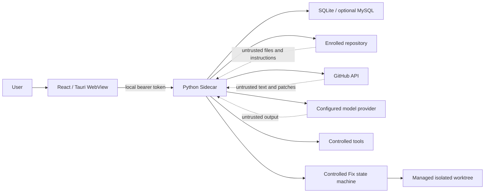

# TraceGate Studio security model

- Last reviewed: 2026-07-12
- Applies to: browser development mode, Tauri desktop shell, Python Sidecar,
  GitHub integration, model providers, repository tools and webhook relay
- Default posture: local-first, least privilege, deny by default

This document states security requirements and records their implementation
status. A requirement is not evidence that its control is already implemented;
the authoritative delivery state remains `docs/implementation-status.md`.

## Assets

- GitHub and model-provider credentials;
- local source repositories, uncommitted changes and Git history;
- PR metadata, comments, diffs and check results;
- repository index, findings, evidence, agent traces and evaluation results;
- local database, logs, exports and application settings;
- tool permission state and write-mode decisions;
- Fix Plans, Patch Proposals, confirmation nonces/hashes, managed worktrees,
  validation output, re-review and Post-Fix reports;
- Sidecar token, port and process identity.

## Trust boundaries

README files, issues, PR descriptions, comments, source comments, strings,
Markdown, configuration, fixtures, generated files and model responses are all
untrusted data. They cannot change system policy or grant tool permission.

## Threats and required controls

| Threat | Required control | Initial state |
| --- | --- | --- |
| Another local process calls the Sidecar | Random per-launch bearer token, loopback bind, restrictive CORS, no token logging | VERIFIED_MACOS |
| Directory traversal | Resolve canonical path and require containment below enrolled root | VERIFIED_MACOS |
| Symlink escape | Resolve each target before read/write and reject outside targets | VERIFIED_MACOS |
| Sensitive-file read | Deny `.env`, SSH, cloud credentials, keychains and configurable patterns | VERIFIED_MACOS |
| Prompt injection | Treat repository/PR/model text as quoted evidence; policy is out of prompt control | VERIFIED_MACOS |
| Arbitrary command execution | Argument-vector allowlist, repository cwd, timeout, output cap and filtered env | VERIFIED_MACOS |
| Destructive patching | Review read-only by default; static patch checks; exact Head/Patch Hash confirmation; isolated worktree; no automatic external mutation | IN_PROGRESS |
| Patch replacement/replay | SHA-256 normalized patch binding, nonce hash, TTL, optimistic lock and single-use consumption | IN_PROGRESS |
| PR Head changes during Fix | Recheck current Head through validation, reindex, re-review and finalization; invalidate proposal and mark session stale | VERIFIED_MACOS |
| User workspace damage | Apply/reset/clean/rollback only inside a registered Fix-owned worktree | IN_PROGRESS |
| Validation command injection | Manifest/preset-derived argument vectors, no shell/model command, executable/script allowlist | IN_PROGRESS |
| Validation secret/output leakage | Filtered environment, synthetic HOME, timeout/cancel, bounded summaries | IN_PROGRESS |
| False repair claim | Required validation + transient reindex + verifier/re-review + deterministic resolution | IN_PROGRESS |
| Worktree residue | Persistent cleanup state, managed-root validation, retention and diagnostics | IN_PROGRESS |
| Credential disclosure | Platform secure storage, redacted logs/API/traces and narrow provider adapters | VERIFIED_MACOS |
| Cross-repository leakage | Repository ID/root attached to every run, tool call and evidence lookup | VERIFIED_MACOS |
| Stale evidence | Bind run, index and evidence to base/head SHA; verifier rejects mismatches | VERIFIED_MACOS |
| Invented dependencies | Graph edges come from Git/parser/index only; model annotations are non-authoritative | VERIFIED_MACOS |
| Webhook forgery/replay | HMAC SHA-256 verification, constant-time compare and delivery-ID deduplication | VERIFIED_MACOS |
| Malicious frontend content | React escaping, CSP, no unsafe HTML, schema validation and bounded response sizes | VERIFIED_MACOS |
| Tauri privilege escalation | Minimal capabilities and commands; no shell plugin permission exposed to the WebView | VERIFIED_MACOS |
| Orphan/duplicate Sidecar | Single instance, PID ownership, bounded restart and graceful true-quit | VERIFIED_MACOS |
| Log/data accumulation | Rotation, retention, explicit export/delete and no source telemetry | IN_PROGRESS |

## Local API

The packaged Sidecar must listen only on `127.0.0.1` using an automatically
selected free port. Tauri creates a cryptographically random launch token and
passes it outside normal command-line/log output where supported. All `/api/v1`
routes require `Authorization: Bearer ...`, including health checks used to
establish that the expected Sidecar—not another local process—is responding.
The health response exposes no credential, workspace contents or provider
secret. Browser development uses an explicit development token and allowlisted
origin; it is not a production bypass.

Security headers include a restrictive CSP, `X-Content-Type-Options: nosniff`,
a same-origin referrer policy and denial of embedding outside the intended
desktop/browser mode. Request bodies and collection endpoints have size and
pagination limits.

## Repository path policy

Tools receive a repository identifier plus a relative path, not an arbitrary
absolute path. The server:

1. looks up the enrolled canonical root;
2. rejects absolute, empty, NUL-containing and `..` paths;
3. resolves the candidate and every symlink;
4. checks canonical containment using path semantics, not string prefixes;
5. applies sensitive-file rules;
6. records a redacted tool event;
7. enforces a byte/line/output limit.

Repository enrollment itself is an explicit user action. One repository's run
cannot use another repository's root or index.

## Tool and agent boundary

Tool schemas are Pydantic-validated and assigned a permission level. Default
analysis uses read-only tools. Network calls are restricted to the configured
GitHub/model endpoints. `run_command` does not invoke an arbitrary shell and
does not inherit the full user environment. Forbidden operations include
deleting the repository, formatting disks, modifying Git history, force push,
reading SSH keys and accessing system credential stores.

Model requests receive only the code scope selected by the user. Repository
instructions cannot enable a tool, increase scope, reveal another run, or
override verifier policy. Structured output is schema-checked; cited files,
lines, symbols and evidence IDs are verified against the current index before a
finding is accepted.

## Controlled Autofix boundary

The existing seven-node Review workflow remains read-only. A user must create
a Fix Session from an existing persisted Finding before the separate 11-node
Fix workflow can run. The session binds repository, PR, Finding, source Run,
base/head SHA and index identity.

### Malicious PR text and prompt injection

PR descriptions, comments, source comments/strings, README instructions,
fixtures and generated code are quoted untrusted evidence. They cannot enable
write mode, alter system/Verifier rules, widen a repository path, select an
arbitrary executable, disable a Tool check, read a credential, or assert final
resolution. Structured model output is validated again by application code.

### Model-generated patch

Patch text is untrusted. Before confirmation the server normalizes and hashes
it, parses a bounded unified diff, verifies the structured changed-file list,
rejects absolute/traversal/quoted/combined/binary targets, resolves symlinks,
applies sensitive-file and size limits, checks exact Head/clean managed
worktree, classifies high-risk changes, and runs `git apply --check`.

The default settings allow at most eight files and 800 changed lines. Settings
may adjust bounded product limits but cannot disable canonical path,
sensitive-file, hash, exact-Head, isolation, or confirmation controls.

### Patch replacement, expiry, and stale Head

Confirmation binds Fix Session, repository, PR, Finding, exact Head SHA,
SHA-256 of normalized patch, nonce hash and expiry. Apply recomputes/verifies
identity and consumes confirmation once. Proposal/hash change, TTL expiry,
replay, optimistic-lock mismatch, or current PR Head change blocks apply; a
Head change marks the session stale rather than applying to different code.

### Isolated mutation and user workspace protection

Apply uses a detached Git worktree below the managed Autofix root at the exact
Head SHA. Validation, reindex, re-review, rollback and cleanup remain rooted
there. The enrolled source workspace is never reset, cleaned or edited; its
uncommitted changes are not a disposable recovery mechanism.

### Controlled validation

Validation commands originate from repository manifests, existing scripts and
controlled presets. Model-proposed shell text is advisory only. The executor
uses argument vectors without a shell, a worktree-scoped cwd, executable/script
allowlists, filtered environment, synthetic managed HOME, timeout,
cancellation/process termination, and bounded stdout/stderr summaries.

Missing tests, timeout, cancellation, nonzero required return code, output
truncation or verifier failure remains explicit. Tests passing alone cannot
yield `RESOLVED`; reindex, re-review and deterministic policy are required.

### Commit/push and failure boundaries

Autofix does not automatically commit, push, comment, open a PR, merge, or
rewrite remote history. Exports are local patch/report files. Every failed or
stale state, residual Finding/risk, rollback result and cleanup failure is
persisted/visible rather than converted into a success report.

### Rollback and cleanup

Rollback hard-resets and cleans only a registered Fix worktree to its recorded
Head. Cleanup validates containment below the managed root and active state.
Residual/expired worktrees are visible in diagnostics; retention cleanup is
bounded and does not silently claim successful deletion.

The detailed transaction threat model and regression matrix are in
[`autofix-safety.md`](autofix-safety.md).

## GitHub and webhook security

Fine-grained credentials use the minimum repository permissions. Public
unauthenticated read mode is explicit. The frontend never receives the token.
Rate-limit state, ETag and request errors are recorded without response headers
that could contain credentials.

The optional relay authenticates device pairing, validates GitHub's signature
over the exact raw request body, rejects unknown event types, deduplicates
delivery IDs and uses an authenticated encrypted channel to a paired client.
Without a configured relay, the UI says “Webhook Relay 未配置” and local polling
continues.

## Logging and diagnostics

Structured logs redact common secret formats and provider-specific headers.
Raw prompts, source files, full PR bodies, Sidecar tokens and credentials are
not normal log fields. Error bodies are bounded and sanitized. Diagnostics may
show boolean configuration state, provider name, port, PID and paths selected
by the user, but never secret values.

Telemetry is off by default. If implemented and enabled by the user, it must not
upload source, prompts, PR content, evidence text or credentials.

## Desktop supply chain

Python Sidecars are built natively per target and checksummed. Windows CI must
never package a macOS artifact. GitHub Actions use least-privilege permissions,
locked tool versions, timeouts and retained test/build evidence. Unsigned alpha
installers are labelled unsigned; code-signing status is never inferred.

## Verification plan

- unit tests for path traversal, symlink escape, sensitive-file matching,
  redaction, auth, CORS, schema validation and tool policies;
- integration tests for Sidecar health/token, database migrations, GitHub ETag,
  webhook HMAC and cancellation;
- frontend tests for escaped untrusted content and explicit error states;
- Rust tests for deep links, lifecycle state and platform paths;
- secret/dependency/code scanning in CI;
- manual Windows install/tray/notification/process acceptance on real hardware.
- Autofix tests for sensitive paths (`.env`, SSH/cloud credentials), traversal,
  absolute paths, symlink escape, binary/size limits, Patch Hash replacement,
  expired/reused confirmation, stale Head, prompt injection, policy/Tool-file
  mutation, command injection, timeout/cancel/output caps, isolated source
  protection, deterministic non-success, rollback and cleanup.

Known gaps are kept visible in `docs/implementation-status.md`; a green build
does not close a manual platform item.
