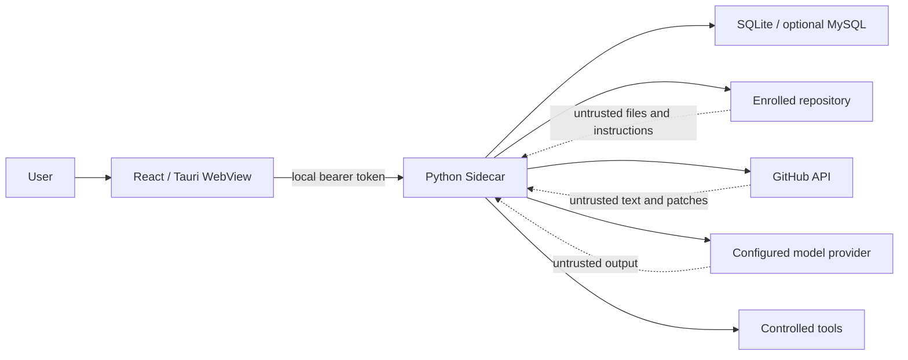

# TraceGate Studio security model

- Last reviewed: 2026-07-10
- Applies to: browser development mode, Tauri desktop shell, Python Sidecar,
  GitHub integration, model providers, repository tools and webhook relay
- Default posture: local-first, least privilege, deny by default

This document states security requirements and records their implementation
status. A requirement is not evidence that its control is already implemented;
the authoritative delivery state remains `docs/implementation-status.md`.

## Assets

- GitHub and model-provider credentials;
- local source repositories, uncommitted changes and Git history;
- PR metadata, comments, diffs and check results;
- repository index, findings, evidence, agent traces and evaluation results;
- local database, logs, exports and application settings;
- tool permission state and write-mode decisions;
- Sidecar token, port and process identity.

## Trust boundaries

README files, issues, PR descriptions, comments, source comments, strings,
Markdown, configuration, fixtures, generated files and model responses are all
untrusted data. They cannot change system policy or grant tool permission.

## Threats and required controls

| Threat | Required control | Initial state |
| --- | --- | --- |
| Another local process calls the Sidecar | Random per-launch bearer token, loopback bind, restrictive CORS, no token logging | VERIFIED_MACOS |
| Directory traversal | Resolve canonical path and require containment below enrolled root | NOT_STARTED |
| Symlink escape | Resolve each target before read/write and reject outside targets | NOT_STARTED |
| Sensitive-file read | Deny `.env`, SSH, cloud credentials, keychains and configurable patterns | NOT_STARTED |
| Prompt injection | Treat repository/PR/model text as quoted evidence; policy is out of prompt control | NOT_STARTED |
| Arbitrary command execution | Argument-vector allowlist, repository cwd, timeout, output cap and filtered env | NOT_STARTED |
| Destructive patching | Write tool disabled by default; show patch/diff; separate confirmation for external mutations | NOT_STARTED |
| Credential disclosure | Platform secure storage, redacted logs/API/traces and narrow provider adapters | VERIFIED_MACOS |
| Cross-repository leakage | Repository ID/root attached to every run, tool call and evidence lookup | NOT_STARTED |
| Stale evidence | Bind run, index and evidence to base/head SHA; verifier rejects mismatches | NOT_STARTED |
| Invented dependencies | Graph edges come from Git/parser/index only; model annotations are non-authoritative | NOT_STARTED |
| Webhook forgery/replay | HMAC SHA-256 verification, constant-time compare and delivery-ID deduplication | NOT_STARTED |
| Malicious frontend content | React escaping, CSP, no unsafe HTML, schema validation and bounded response sizes | VERIFIED_MACOS |
| Tauri privilege escalation | Minimal capabilities and commands; no shell plugin permission exposed to the WebView | VERIFIED_MACOS |
| Orphan/duplicate Sidecar | Single instance, PID ownership, bounded restart and graceful true-quit | VERIFIED_MACOS |
| Log/data accumulation | Rotation, retention, explicit export/delete and no source telemetry | IN_PROGRESS |

## Local API

The packaged Sidecar must listen only on `127.0.0.1` using an automatically
selected free port. Tauri creates a cryptographically random launch token and
passes it outside normal command-line/log output where supported. All `/api/v1`
routes require `Authorization: Bearer ...`, including health checks used to
establish that the expected Sidecar—not another local process—is responding.
The health response exposes no credential, workspace contents or provider
secret. Browser development uses an explicit development token and allowlisted
origin; it is not a production bypass.

Security headers include a restrictive CSP, `X-Content-Type-Options: nosniff`,
a same-origin referrer policy and denial of embedding outside the intended
desktop/browser mode. Request bodies and collection endpoints have size and
pagination limits.

## Repository path policy

Tools receive a repository identifier plus a relative path, not an arbitrary
absolute path. The server:

1. looks up the enrolled canonical root;
2. rejects absolute, empty, NUL-containing and `..` paths;
3. resolves the candidate and every symlink;
4. checks canonical containment using path semantics, not string prefixes;
5. applies sensitive-file rules;
6. records a redacted tool event;
7. enforces a byte/line/output limit.

Repository enrollment itself is an explicit user action. One repository's run
cannot use another repository's root or index.

## Tool and agent boundary

Tool schemas are Pydantic-validated and assigned a permission level. Default
analysis uses read-only tools. Network calls are restricted to the configured
GitHub/model endpoints. `run_command` does not invoke an arbitrary shell and
does not inherit the full user environment. Forbidden operations include
deleting the repository, formatting disks, modifying Git history, force push,
reading SSH keys and accessing system credential stores.

Model requests receive only the code scope selected by the user. Repository
instructions cannot enable a tool, increase scope, reveal another run, or
override verifier policy. Structured output is schema-checked; cited files,
lines, symbols and evidence IDs are verified against the current index before a
finding is accepted.

## GitHub and webhook security

Fine-grained credentials use the minimum repository permissions. Public
unauthenticated read mode is explicit. The frontend never receives the token.
Rate-limit state, ETag and request errors are recorded without response headers
that could contain credentials.

The optional relay authenticates device pairing, validates GitHub's signature
over the exact raw request body, rejects unknown event types, deduplicates
delivery IDs and uses an authenticated encrypted channel to a paired client.
Without a configured relay, the UI says “Webhook Relay 未配置” and local polling
continues.

## Logging and diagnostics

Structured logs redact common secret formats and provider-specific headers.
Raw prompts, source files, full PR bodies, Sidecar tokens and credentials are
not normal log fields. Error bodies are bounded and sanitized. Diagnostics may
show boolean configuration state, provider name, port, PID and paths selected
by the user, but never secret values.

Telemetry is off by default. If implemented and enabled by the user, it must not
upload source, prompts, PR content, evidence text or credentials.

## Desktop supply chain

Python Sidecars are built natively per target and checksummed. Windows CI must
never package a macOS artifact. GitHub Actions use least-privilege permissions,
locked tool versions, timeouts and retained test/build evidence. Unsigned alpha
installers are labelled unsigned; code-signing status is never inferred.

## Verification plan

- unit tests for path traversal, symlink escape, sensitive-file matching,
  redaction, auth, CORS, schema validation and tool policies;
- integration tests for Sidecar health/token, database migrations, GitHub ETag,
  webhook HMAC and cancellation;
- frontend tests for escaped untrusted content and explicit error states;
- Rust tests for deep links, lifecycle state and platform paths;
- secret/dependency/code scanning in CI;
- manual Windows install/tray/notification/process acceptance on real hardware.

Known gaps are kept visible in `docs/implementation-status.md`; a green build
does not close a manual platform item.
